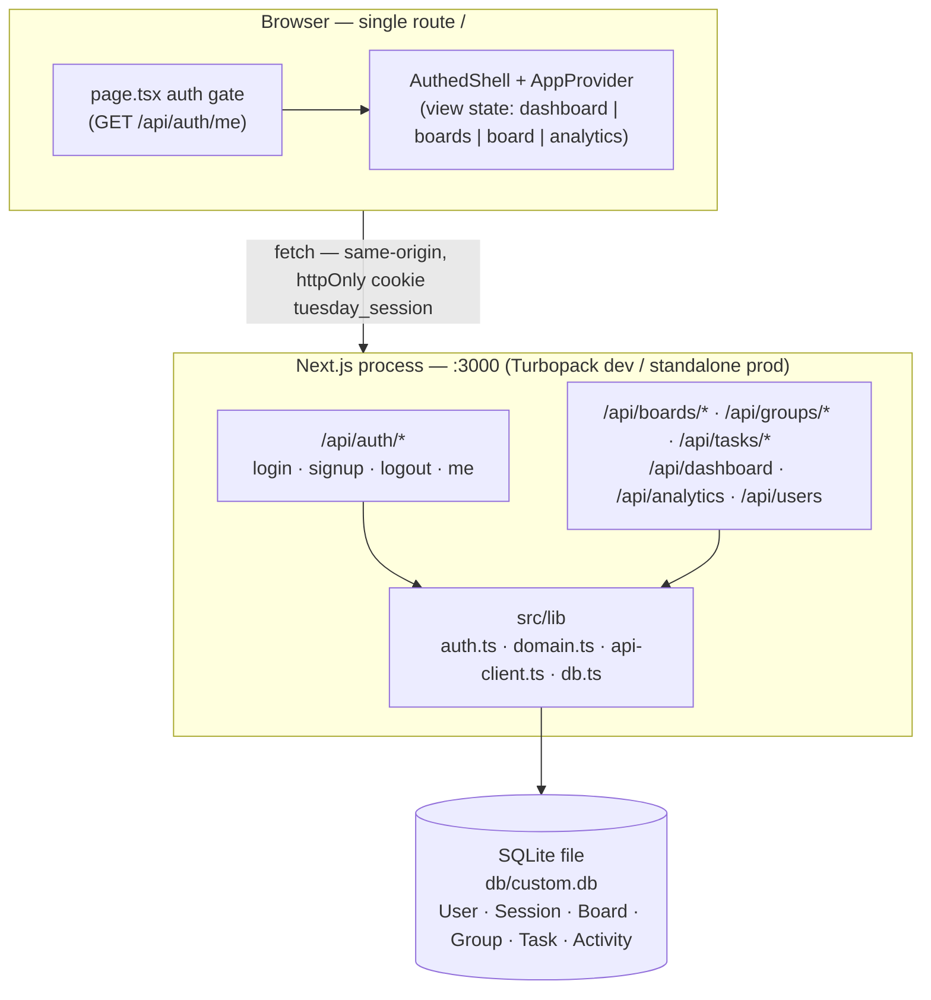
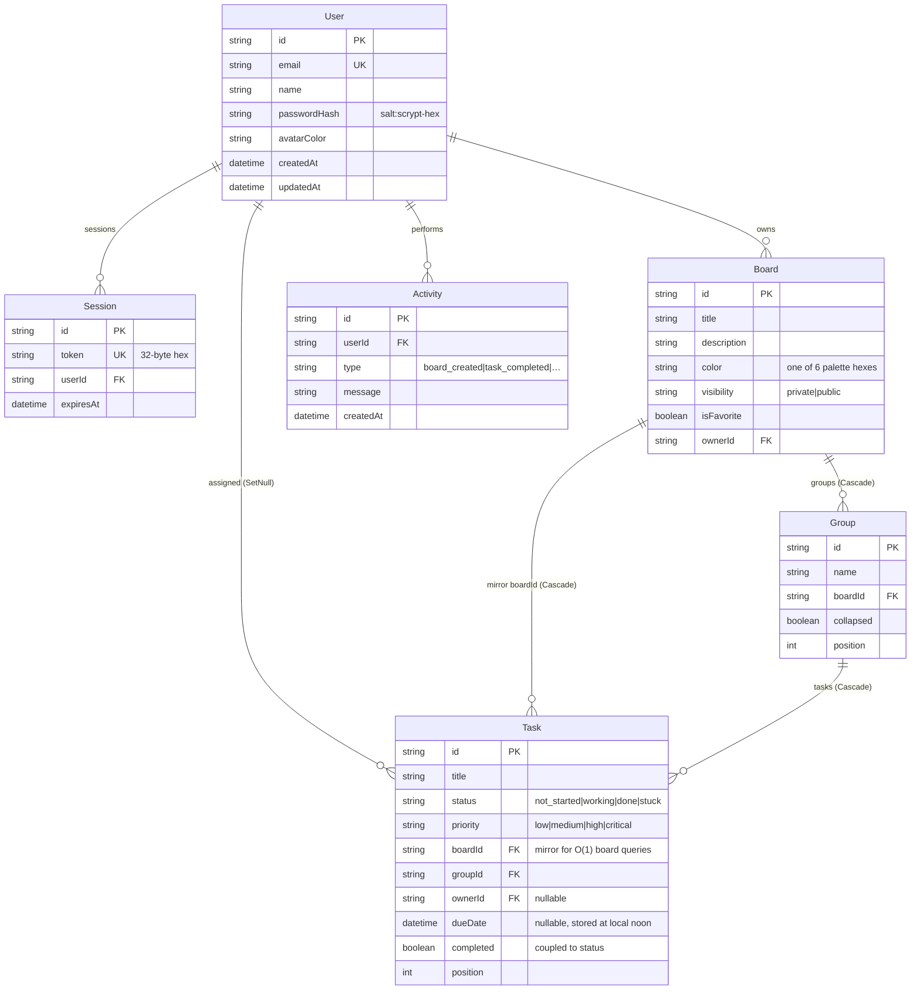

# Tuesday.com — Master Project Architecture Document (PAD) v1.2

**Classification:** Internal Engineering Reference
**Status:** DEFINITIVE, PRODUCTION-LOCKED BLUEPRINT
**Companion Documents:** `README.md` (onboarding), `AGENTS.md` (agent gotchas), `CLAUDE.md` (workflow contract)
**Last Updated:** 2026-09-16
**Audience:** Senior Engineers, Tech Leads, DevOps, and Onboarding Engineers
**Rule:** Every architectural decision in this document traces to a specific rationale.
           Nothing is here "because it's popular."

#### Revision Block — v1.2 (Parity Deep-Pass, 2026-09-16)

- `[SYN]` Second reference-parity pass driven by a live DOM/computed-style
  audit of the reference app: Edit Board dialog (title/description/colors/
  visibility), toolbar Filter (Status+Priority checkboxes), Sort popover
  (Task Name / Created Date / Updated Date — `TaskDTO` gained `updatedAt`),
  Show/Hide Columns, toolbar scoped to the Main Table view only, searchable
  owner picker ("Enter name…"), native-date due-date cell, per-group footer
  summary row, reference group-header layout, gradient KPI cards (exact probed
  pairs + deco discs), briefcase gradient logo, nav active pills,
  "Search everything…" header search, reference toolbar icon set,
  boards-page folder cards with rose visibility badges and "about N hours ago"
  timestamps, dashboard folder-tile board cards, login restyle (circular slate
  logo, top gradient bar, mail/lock input icons, white Google button), kanban
  lavender heading tile + large empty-column discs, mobile hamburger drawer,
  and the demo seed renamed to `sepnetflix2023` so the greeting matches the
  reference account. All browser-verified; edit-board persistence confirmed
  against SQLite.
- `[GAT]` Unit suite grew 23→46 tests: new pure seams `filterTasks`,
  `sortTasks`, `visibleColumns`, `groupSummary`, `relativeBoardTime`, and
  `VISIBILITY_OPTIONS` (TDD: red first).
- `[FIX]` `PATCH /api/boards/[id]` now accepts `visibility`
  (Zod enum private|public) — previously un-editable after creation.
- `[DEV]` Deliberate deviations documented in §10 (reference analytics
  priority bug, inert boards Filter button, popover persistence quirk).

#### Revision Block — v1.1 (Parity & Quality Pass, 2026-09-16)

- `[SYN]` Gantt timeline (Day/Week/Month zoom), kanban Status/People
  grouping with drag-to-assign, table Group-by + Filter-by-Person, board
  header "items ▪ Saved" indicator, Sun-first calendar, solid analytics
  cards with bar distributions, dashboard hero live task count, honest
  header controls (global search, notifications, toasts) — all
  browser-verified against the live reference app.
- `[GAT]` Quality gates restored to honest strictness: ESLint runs
  `eslint-config-next` defaults with zero rule weakening; `tsconfig` drops
  the `noImplicitAny` override and excludes `skills/`/`docs/` from the
  compile; a Vitest unit suite (23 tests) covers the pure domain seams.
- `[DEP]` 16 unused dependencies removed (incl. recharts + the vendored
  chart scaffold and sidebar, both dead).
- `[FIX]` `docs/ssh_git_wrapper_v3.py` repaired — it previously rejected
  every real OpenSSH key (a redaction-mangled marker check); it now
  validates proper BEGIN/END delimiters and normalizes redacted keys.

#### Revision Block — v1.0 (Initial Release)

- `[SYN]` Initial blueprint synthesized from the verified codebase after full
  interactive verification (login, board/task CRUD, kanban drag-and-drop
  persisted to SQLite, analytics, mobile viewport, lint + typecheck gates).
- `[SAN]` Secret scan executed against the tree: no SSH keys, no `.env`, no
  production credentials. The seeded demo account
  (`sepnetflix2023@outlook.com` / `Abcd1234`) is an intentionally public
  demo credential mirroring the reference app's test login.

---

## Table of Contents

1. [System Overview & Decisions](#1-system-overview--decisions)
2. [High-Level System Topology](#2-high-level-system-topology)
3. [Application Architecture](#3-application-architecture)
4. [Data Architecture](#4-data-architecture)
5. [Design System Reference](#5-design-system-reference)
6. [Security Architecture](#6-security-architecture)
7. [Testing Strategy](#7-testing-strategy)
8. [Build & Deployment](#8-build--deployment)
9. [Developer Handbook](#9-developer-handbook)
10. [Known Issues & Outstanding Tasks](#10-known-issues--outstanding-tasks)
11. [Key Files Reference](#11-key-files-reference)
12. [Glossary](#12-glossary)

---

## 1. System Overview & Decisions

### 1.1 Document Metadata & Purpose

This PAD is the single source of truth for Tuesday.com's architecture. Use it
to onboard (§3, §9), to review tech choices (§1.3 ADRs), to debug (§3.3 code
patterns + §6 security invariants), or to replicate the deployment (§8). It
describes the system as built and verified on 2026-09-15 — current state
only; future plans live in §10 as tracked debt.

Tuesday.com is a monday.com-style work management app: users own **boards**,
boards contain **groups**, groups contain **tasks** with status / priority /
owner / due-date. Five views (table, kanban, calendar, timeline, unassigned)
render the same data; an analytics page aggregates it. The reference product
being cloned is `https://tuesdaycom-a6700714.base44.app/`.

### 1.2 Technology Stack Summary

| Layer | Technology | Version | Key Rationale |
|-------|------------|---------|---------------|
| Package manager / runtime | Bun | ≥1.1 (lockfile committed) | One tool for install + script run + TS execution (`scripts/seed.ts` runs without a build step) |
| Web framework | Next.js (App Router) | 16.1.3 | UI + API in one process; async request APIs (`cookies()`, `params`) are Promises |
| UI runtime | React | 19.2.3 | Concurrent rendering; enforced hooks lint (see ADR-006 note) |
| Language | TypeScript | 5, `strict: true` | `tsc --noEmit` is a delivery gate; 0 errors under `src/` |
| Styling | Tailwind CSS | 4.1.18 | CSS-first `@theme inline` tokens; **no JS theme config** — v3-style config removed as dead weight |
| Component primitives | shadcn/ui (new-york) on Radix | vendored in `src/components/ui/` | Dialog/Popover/Select/Calendar semantics (focus traps, ARIA) for free; no runtime dependency on a component library |
| ORM | Prisma | 6.19.2 | Typed client; `db push` keeps the disposable SQLite DB in sync with the schema |
| Database | SQLite | 3 | Zero-config single-file persistence; adequate for single-owner workloads (ADR-002) |
| Input validation | Zod | 4 | Every API body parsed before use; 400 with first issue message |
| Drag & drop | @dnd-kit/core | 6.3.1 | Pointer-sensor DnD with activation distance; persists status changes (ADR-007) |
| Dates | date-fns | 4.1.0 | Formatting + month-grid math; noon-storage convention (§3.3 P3) |
| Icons | lucide-react | 0.525.0 | Icon vocabulary matched to the reference app |
| Font | Inter | via `next/font` | Reference app's typographic feel; Latin subset |

### 1.3 Architecture Decision Records (ADRs)

**ADR-001: Single user-visible route with client-side view switching**

- **Context:** The product has four top-level surfaces (dashboard, boards
  list, board detail, analytics) plus a login gate. The deployment target
  exposes exactly one route (`/`), and every surface must sit behind the
  session check.
- **Decision:** One route — `src/app/page.tsx` boots `/api/auth/me`, then
  renders `<AuthedShell>` which switches views from `AppProvider` context
  state (`{ name, boardId }`). API route handlers are the only other HTTP
  surface.
- **Rationale:** No route can render outside the auth gate; view transitions
  are instant (no round trip); the sandbox constraint becomes an enforced
  architectural invariant instead of a limitation.
- **Consequences:** Browser back button doesn't traverse app views; deep
  links to a board don't exist. Acceptable for a v1 clone; if deep links
  become a requirement, mirror `view` into `location.hash` inside the same
  provider.
- **Alternatives Rejected:** Multi-page App Router routes (breaks the
  one-route deployment contract, duplicates the auth gate per page);
  hash-router from a library (extra dependency for a four-value enum).

**ADR-002: SQLite behind Prisma instead of PostgreSQL**

- **Context:** Work management data is small (tens of boards, hundreds of
  tasks per user), single-writer in practice, and the project must boot with
  zero external services.
- **Decision:** SQLite file at `db/custom.db` via Prisma; schema in
  `prisma/schema.prisma`; the DB is disposable and always recreated by
  `db:push` + `db:seed`.
- **Rationale:** `bun install && bun run db:push && bun run db:seed` is the
  entire setup; no container, no credentials, no network. Prisma keeps the
  schema declarative and the client typed.
- **Consequences:** No concurrent multi-process writes (SQLite
  file locking); no PG-specific features (generated columns, trigram search).
  The Prisma abstraction makes a later Postgres move a schema-file + URL
  change, not a rewrite.
- **Alternatives Rejected:** PostgreSQL in Docker (setup cost without a
  workload that needs it); in-memory/localStorage persistence (loses
  durability and server-side auth).

**ADR-003: Hand-rolled scrypt + opaque session cookies instead of NextAuth**

- **Context:** The app needs email/password only; the reference's Google
  OAuth is explicitly out of scope (no provider credentials in this
  deployment).
- **Decision:** `src/lib/auth.ts` — Node `crypto.scryptSync` password hashing
  (16-byte salt, 64-byte key), 32-byte random session tokens stored in the
  `Session` table, set in the httpOnly `tuesday_session` cookie (sameSite
  lax, 30-day TTL, lazy expiry cleanup on read).
- **Rationale:** ~80 lines of auditable code versus a framework dependency;
  the session table gives server-side revocation (delete row = logout
  everywhere); no JWT to reason about.
- **Consequences:** No OAuth providers, no e-mail flows — those surface as
  honest "not configured on this deployment" messages. Adding OAuth later
  means adding a provider module, not replacing the session model.
- **Alternatives Rejected:** NextAuth v4 (heavy for one credential type;
  Google provider would fake a configured integration); JWT in cookies
  (revocation requires a denylist — more machinery than a session table).

**ADR-004: `ActionResult<T>` envelope + Zod at every API boundary**

- **Context:** Route handlers and the client need a uniform error contract;
  nothing should ever throw across the fetch boundary.
- **Decision:** Every handler returns `{ ok: true, data } | { ok: false,
  error }` (`src/lib/domain.ts`); inputs are Zod-parsed with the first issue
  message surfaced as a 400. The client wrapper (`api-client.ts`) resolves
  the envelope and produces a network-error fallback — it never throws.
- **Rationale:** One `if (result.ok)` shape in every consumer; error text is
  human-safe by construction; the login endpoint returns a uniform "Invalid
  email or password" (no existence oracle).
- **Consequences:** Errors are strings, not typed codes — sufficient at this
  scale; if machine-readable codes become necessary, widen `error` to a union
  without breaking the envelope.
- **Alternatives Rejected:** Throwing + response.status only (client must
  parse bodies defensively per endpoint); tRPC (a second runtime contract for
  a 10-endpoint app).

**ADR-005: Local state patched only after server confirmation (with one deliberate optimistic path)**

- **Context:** Every mutation round-trips the API; the UI must never
  disagree with the DB.
- **Decision:** Mutations await `ActionResult` and then patch local state.
  The single exception is group collapse (`toggleCollapse`), which patches
  first and reverts on API failure.
- **Rationale:** Correctness-first (CLAUDE.md principle); the revert-on-
  failure shape keeps even the optimistic path honest.
- **Consequences:** One extra round trip per edit — imperceptible at this
  scale.
- **Alternatives Rejected:** Full optimistic UI everywhere (every path needs
  its own revert logic — risk without measurable latency win).

**ADR-006: shadcn/ui + Radix primitives on Tailwind v4 CSS-first tokens**

- **Context:** The clone needs dialog/popover/select/calendar/dropdown
  semantics with correct focus management and ARIA, and the reference's exact
  visual language.
- **Decision:** Vendored shadcn/ui (new-york) components as the primitive
  layer; the Tuesday.com palette as literal hex in `:root` / `.dark` and
  `@theme inline` mappings in `globals.css`; no `tailwind.config.js`.
- **Rationale:** Free accessibility machinery (focus traps, `aria-expanded`,
  keyboard nav) and free theming via CSS variables; deleting the v3-style
  config file removed dead weight (v4 does not auto-load it).
- **Consequences:** Component updates are copy-paste (vendored, not npm).
  Acceptable — the primitives are stable.
- **Alternatives Rejected:** MUI/Chakra (opinionated styling fights the
  pixel-fidelity requirement); hand-rolled primitives (weeks of a11y work).

**ADR-007: @dnd-kit for kanban drag-and-drop**

- **Context:** Dragging a card between status columns is the product's
  signature interaction; HTML5 DnD is unusable on touch.
- **Decision:** `@dnd-kit/core` with a PointerSensor (6px activation
  distance so clicks still work), droppable status columns, and a DragOverlay
  preview. `onDragEnd` fires the same `updateTask({ status })` path as the
  table's status pill.
- **Rationale:** Pointer events cover mouse + touch; one mutation path means
  drag and click can't drift apart.
- **Consequences:** ~1KB of interaction code; cards are drag surfaces (with
  `touch-none`) — future in-card controls must account for the activation
  distance.
- **Alternatives Rejected:** Native HTML5 DnD (no touch, poor API);
  react-beautiful-dnd (unmaintained, React 17 idioms).

---

## 2. High-Level System Topology



- **Browser layer**: one document; all interactivity is client components.
  No external CDN, no analytics beacons, no third-party scripts.
- **Application layer**: a single Next.js process. Route handlers are
  server-only; `z-ai-web-dev-sdk` (present in the sandbox scaffold) is NOT
  used by this app — there are no AI features in v1.
- **Data layer**: one SQLite file, process-local. No cache tier (queries are
  millisecond-scale indexed reads).
- **External services**: none. Features that would need them (OAuth, e-mail)
  render explicit "not configured" states.
- **Scaling characteristics**: vertical only. The constraint is SQLite's
  single-writer lock; the escape hatch is Prisma + Postgres (ADR-002).

---

## 3. Application Architecture

### 3.1 The Layer Model

```
Layer 0: Vocabulary & Contracts — src/lib/domain.ts
         Statuses, priorities, colors, DTOs, ActionResult<T>.
         Rule: every status/priority/color literal in the app originates here.

Layer 1: Data Access — prisma/schema.prisma + src/lib/db.ts
         Prisma client singleton; schema is the declarative truth.
         Rule: no SQL outside Prisma; no business logic here.

Layer 2: API Route Handlers — src/app/api/**
         Zod input parsing → ownership check → Prisma mutation → ActionResult.
         Rule: never throw across the boundary; every body is parsed first.

Layer 3: Client Transport — src/lib/api-client.ts
         Typed fetch, envelope resolution, network-error fallback.
         Rule: never throws; callers branch on result.ok.

Layer 4: Application State — src/components/app/app-context.tsx
         User + current view; navigation; sign-out.
         Rule: view state lives here and nowhere else.

Layer 5: Product UI — src/components/app/*
         Views (dashboard, boards, board, analytics) and cell/dialog components.
         Rule: patch local state only after Layer 2 confirms (ADR-005).

Layer 6: UI Primitives — src/components/ui/*  (vendored shadcn/Radix)
         Rule: product code composes these; never restyle internals blindly.
```

The Golden Rule: dependencies point strictly downward (0 ← 1 ← 2 ← 3 ← 4 ← 5
← 6 in terms of who imports whom — UI may import anything above it; `domain.ts`
imports nothing from the app).

### 3.2 Annotated Directory Structure

```
├── prisma/schema.prisma          ← User, Session, Board, Group, Task, Activity + indexes/cascades
├── scripts/seed.ts               ← Idempotent demo dataset (upsert-by-email; skips if boards exist)
├── public/icon.svg               ← Blue "T" favicon
├── src/app/
│   ├── page.tsx                  ← THE route: auth gate → AuthedShell view switch
│   ├── layout.tsx                ← Inter font, metadata, Toaster
│   ├── globals.css               ← Tuesday.com theme: :root/.dark hex tokens, @theme inline, scrollbars, deco circles, reduced-motion
│   └── api/
│       ├── auth/login/route.ts        ← POST: Zod → scrypt verify → session cookie (uniform 401)
│       ├── auth/signup/route.ts       ← POST: Zod → uniqueness → create user + session
│       ├── auth/logout/route.ts       ← POST: delete session row + cookie
│       ├── auth/me/route.ts           ← GET: resolve session user (lazy expiry sweep)
│       ├── boards/route.ts            ← GET: list + ONE grouped aggregate for counts; POST: create board + default group + activity
│       ├── boards/[id]/route.ts       ← GET: board + groups + tasks + members; PATCH: title/desc/color/favorite; DELETE: cascade + activity
│       ├── boards/[id]/groups/route.ts← POST: append group (position = max+1)
│       ├── groups/[id]/route.ts       ← PATCH: name/collapsed; DELETE (cascade) — ownership via join to board
│       ├── tasks/route.ts             ← POST: create task in owned-board group
│       ├── tasks/[id]/route.ts        ← PATCH: status↔completed coupling; DELETE — ownership via join
│       ├── dashboard/route.ts         ← GET: KPI stats + recent boards + activity feed
│       ├── analytics/route.ts         ← GET: window-bounded stats + distributions + per-board performance
│       └── users/route.ts             ← GET: assignable members
├── src/components/app/
│   ├── app-context.tsx           ← view state machine + navigation + sign-out
│   ├── app-header.tsx            ← logo, nav, search, icon buttons, avatar menu
│   ├── login-view.tsx            ← login/signup toggle, Google button (honest unconfigured state)
│   ├── dashboard-view.tsx        ← hero, 4 KPI stat cards, recent boards, quick actions, activity
│   ├── boards-view.tsx           ← grid/list, search, favorites filter, board cards, delete confirm
│   ├── board-view.tsx            ← board header (rename, view dropdown, favorite, members), toolbar, 5 views, dialogs
│   ├── board-table.tsx           ← groups + column headers + task rows (checkbox, inline title, cells)
│   ├── board-kanban.tsx          ← @dnd-kit columns by status; drag → status mutation
│   ├── board-calendar.tsx        ← month grid (Mon-first, 42 cells), status-colored chips, legend
│   ├── status-cell.tsx           ← pill popover (listbox semantics)
│   ├── priority-cell.tsx         ← flag bars (1–4) + popover
│   ├── owner-cell.tsx            ← avatar picker + unassign
│   ├── date-cell.tsx             ← calendar popover, noon storage, overdue styling
│   ├── create-board-dialog.tsx   ← title/description/6 colors/visibility; form mounts inside DialogContent
│   ├── create-task-dialog.tsx    ← title + group select; same fresh-mount pattern
│   ├── analytics-view.tsx        ← board + window filters, 4 solid stat cards, bar distributions, performance list
│   └── board-timeline.tsx        ← Gantt timeline: Day/Week/Month zoom, day columns, due-date bars
├── src/lib/
│   ├── domain.ts                 ← TASK_STATUSES, TASK_PRIORITIES, BOARD_COLORS, DTOs, ActionResult
│   ├── auth.ts                   ← scrypt hash/verify, session create/destroy, getSessionUser
│   ├── api-client.ts             ← api<T>(path, init) → ActionResult<T>
│   └── db.ts                     ← Prisma singleton (warn/error logging only)
├── docs/                         ← repo docs incl. ssh_git_wrapper_v3.py + push runbook
└── skills/                       ← the owner's skill library (not part of the app)
```

### 3.3 Critical Code Patterns

**P1 — The mutation path (server→client, the app's spine)**

```typescript
// src/app/api/tasks/[id]/route.ts (excerpt) — Layer 2
const updateTaskSchema = z.object({
  title: z.string().trim().min(1).max(200).optional(),
  status: z.enum(STATUS_VALUES).optional(),      // vocabulary closed in domain.ts
  completed: z.boolean().optional(),
  /* …priority, ownerId, dueDate */
});

export async function PATCH(request: NextRequest, ctx: { params: Promise<{ id: string }> }) {
  const user = await getSessionUser();           // cookie → session row → user
  if (!user) return NextResponse.json({ ok: false, error: "Not authenticated" }, { status: 401 });
  const { id } = await ctx.params;               // Next 16: params is a Promise

  const task = await db.task.findFirst({ where: { id, board: { ownerId: user.id } } });
  if (!task) return NextResponse.json({ ok: false, error: "Task not found" }, { status: 404 });

  // …Zod parse → 400 on failure …

  const patch: Record<string, unknown> = { ...parsed.data };
  // THE coupling — one exported pure function, shared by server and client.
  Object.assign(patch, resolveStatusCompletedPatch(parsed.data));
  await db.task.update({ where: { id }, data: patch });
  return NextResponse.json({ ok: true, data: null });
}
```

```typescript
// src/components/app/board-view.tsx (excerpt) — Layer 5 mirrors the coupling
const localPatch = resolveStatusCompletedPatch(patch);
setBoard((prev) => /* map the task with localPatch */);
```

*Why this pattern:* `status` and `completed` are one fact in two columns.
The coupling lives in ONE unit-tested function
(`resolveStatusCompletedPatch`, `src/lib/domain.ts`); the server applies it
in the PATCH handler and the client mirrors it **after** confirmation so
the checkbox, status pill, kanban column, group progress, and analytics
percentages can never disagree. Any new mutation path (bulk edit, import)
calls the same function — there is no second copy to forget.

**P2 — Lint-compliant data loading (effects that fetch)**

```typescript
// dashboard-view.tsx (excerpt)
const load = useCallback(() => api<DashboardDTO>("/api/dashboard"), []); // pure: no setState

useEffect(() => {
  let cancelled = false;
  load().then((result) => {                 // setState lives in the .then callback
    if (cancelled) return;
    if (result.ok) { setData(result.data); setError(null); }
    else setError(result.error);
  });
  return () => { cancelled = true; };       // strict-mode double-invoke safe
}, [load]);
```

*Why this pattern:* `react-hooks/set-state-in-effect` flags synchronous
setState in effect bodies. Keeping `load` pure (it returns the promise) and
settling state in the callback satisfies the rule without disabling it —
a green gate achieved by structure, not suppression.

**P3 — Dialog forms that reset themselves (no effects)**

```tsx
// create-board-dialog.tsx (excerpt)
export function CreateBoardDialog({ open, onOpenChange, onCreated }) {
  return (
    <Dialog open={open} onOpenChange={onOpenChange}>
      <DialogContent className="sm:max-w-md">
        <CreateBoardForm onClose={() => onOpenChange(false)} onCreated={onCreated} />
      </DialogContent>
    </Dialog>
  );
}
// CreateBoardForm holds ALL form state in useState initializers…
```

*Why this pattern:* Radix unmounts `DialogContent` when the dialog closes, so
the form component remounts fresh on every open. The classic
`useEffect(() => open && reset())` is both lint-blocked and redundant here.

**P4 — One grouped aggregate instead of per-board counts**

```typescript
// boards/route.ts (excerpt)
const statusRows = await db.task.groupBy({
  by: ["groupId", "status"],
  where: { groupId: { in: groupIds } },
  _count: { _all: true },
});
// then a linear fold over rows via a groupToBoard map
```

*Why this pattern:* the boards grid is O(1) round trips regardless of board
count. A per-board `include + count` loop is an N+1 read pattern waiting to
happen as boards grow.

**P5 — Due dates at local noon**

```typescript
// date-cell.tsx (excerpt)
function handleSelect(day: Date | undefined) {
  if (!day) return;
  day.setHours(12, 0, 0, 0);   // never midnight: no timezone edge can shift the day
  onChange(day.toISOString());
}
```

*Why this pattern:* ISO strings at 00:00 render as "yesterday" for users west
of UTC; noon is stable for the same-day comparison the calendar and overdue
styling rely on.

---

## 4. Data Architecture

### 4.1 Database Schema



### 4.2 Data Models

The TypeScript mirrors of these rows are the `*DTO` interfaces in
`src/lib/domain.ts` (`TaskDTO`, `GroupDTO`, `BoardDetailDTO`, `DashboardDTO`,
`AnalyticsDTO`, `UserDTO`). Route handlers convert rows to DTOs explicitly
(`toTaskDTO`) — dates become ISO strings; owners become nullable `UserDTO`.
The client only ever sees DTOs.

### 4.3 Persistence Strategy

- **Client**: Prisma global-singleton (`db.ts`) — one client per process;
  dev-mode caching on `globalThis` to survive HMR.
- **Schema sync**: `bun run db:push` (no migration history — the DB is
  disposable by design; schema + seed reproduce it deterministically).
- **Seed**: `scripts/seed.ts` is idempotent — users upsert by email; board
  creation skips when the demo user already owns boards. Teammates get
  random unusable password hashes (they are picker entries, not accounts).
- **Indexes**: `Board.ownerId`, `Group.boardId`, `Task.boardId/groupId/ownerId`,
  `Session.userId`, `Activity.userId/createdAt`.
- **Cascades**: deleting a board removes its groups and tasks; deleting a
  group removes its tasks; deleting a user clears assigned ownership
  (`SetNull`) and cascades sessions/activities.

---

## 5. Design System Reference

### 5.1 Typographic System

| Role | Face | Notes |
|------|------|-------|
| All UI text | Inter (`next/font`, latin subset) | Fallback: system stack |
| Board/task titles | Inter 700 | `text-xl` / inline-weight at row level |
| Muted meta | Inter 400–500 | `--muted-foreground` |

### 5.2 Color Tokens

| Token | Hex | WCAG (on white) | Usage |
|-------|-----|-----------------|-------|
| `--background` | `#f5f7fa` | — | App canvas |
| `--card` | `#ffffff` | — | Surfaces |
| `--foreground` | `#323338` | 12.6:1 | Primary text |
| `--muted-foreground` | `#6b7385` | 5.0:1 | Secondary text (AA body) |
| `--border` | `#e6e9ef` | — | Hairlines |
| `--primary` | `#0073ea` | 4.6:1 | Buttons, links, focus rings (AA) |
| `--destructive` | `#e2445c` | 4.5:1 | Danger actions, overdue |
| `--nav-active-bg` | `#e1e5f3` | — | Active nav pill |
| `--nav-hover-bg` | `#f5f6f8` | — | Nav + group-header hover |
| `--table-header-bg` | `#f5f6f8` | — | Column-header band |
| `--table-track-bg` | `#e1e5f3` | — | Group progress track |
| `--group-progress-fill` | `#00c875` | — | Group progress fill |

Status pills carry their own pairs (bg/text): Not Started `#e8e9eb`/`#323338`,
Working on it `#fddf3d`/`#323338`, Done `#00ca72`/white, Stuck `#e2445c`/white.
Priority flags: Low `#579bfc`, Medium `#fcc203`, High `#ff642e`, Critical
`#e2445c` — always paired with the 1–4 bar count so urgency never relies on
color alone. KPI cards are **gradient pairs** (probed from the reference):
dashboard `to right bottom` — blue `#3b82f6→#2563eb`, green `#22c55e→#16a34a`,
orange `#f59e0b→#f97316`, purple `#a855f7→#9333ea`; analytics `to right` with
Overdue `#ef4444→#dc2626`; each card carries translucent deco discs (64px @
white/10 top-right, 48px @ white/5 bottom-left). Quick actions:
`#06b6d4`/`#22c55e`/`#f97316`/`#d946ef` with a purple gradient header tile.
Board palette (6): `#0073ea`, `#00ca72`, `#ff642e`, `#e2445c`, `#a25ddb`,
`#00d5c0`. The header logo is a gradient tile (`#2563EB→#1D4ED8`) with a white
briefcase icon; board cards tint the folder icon at 12.5% alpha of the board
color.

### 5.3 Component Primitives

shadcn/ui (new-york) vendored under `src/components/ui/`. Product components
compose Dialog, DropdownMenu, Popover, Select, Calendar, AlertDialog, Avatar,
Checkbox, Progress, ScrollArea, Skeleton, Table primitives, and the Sonner
toaster. Custom product surfaces (stat cards, status pills, priority flags,
kanban columns) wrap these or use plain elements with the tokens above.

### 5.4 Motion / Animation

Tailwind `transition-*` utilities plus Radix enter/exit animations via
`tw-animate-css`. Kanban uses a rotate-2 DragOverlay. One global rule in
`globals.css`: `prefers-reduced-motion: reduce` collapses every animation and
transition to 0.01ms.

---

## 6. Security Architecture

### 6.1 Security Rules

| # | Rule | Enforcement |
|---|------|-------------|
| 1 | Treat every request body as untrusted | Zod schema at the top of every handler; 400 with first issue |
| 2 | No secrets in code or repo | `.gitignore` (`.env*`, keys, DB files); secret scan run before commit; seeded demo creds are documented public values |
| 3 | Sessions are httpOnly cookies | `cookies().set` with `httpOnly, sameSite=lax, secure in prod` (`src/lib/auth.ts`) |
| 4 | Ownership on every read/write | `findFirst({ where: { id, ownerId: user.id } })` (or the equivalent join) in every board/group/task handler |
| 5 | No existence oracle | Login: uniform "Invalid email or password"; resource misses: 404 "not found" |
| 6 | No injection surface | Prisma parameterized queries only; no string-built SQL; React escapes all rendered text |
| 7 | Customer-safe error text | Handlers return human messages; operator detail goes to `console.error` server-side only |
| 8 | Least-privilege cookies | One cookie, one purpose (session); no client-readable tokens |

### 6.2 Security Utilities

- `src/lib/auth.ts` — `hashPassword` / `verifyPassword` (scrypt +
  `timingSafeEqual` with a length guard), `createSession` / `destroySession`,
  `getSessionUser` (lazy expiry sweep).
- `src/lib/domain.ts` — closed vocabularies keep status/priority enums
  exhaustively validated (Zod `.enum(STATUS_VALUES)`).
- `scripts/seed.ts` — teammates seeded with random 24-byte-hex passwords
  (accounts that cannot log in).

### 6.3 Authentication & Authorization

- **Session model**: opaque 32-byte hex token (crypto-random) → `Session` row
  → user. Server-side revocation by row deletion. 30-day TTL, swept lazily
  on read.
- **Authorization model**: single-owner. Boards (and everything under them)
  are gated by `ownerId`; the members list shown in pickers is all users —
  assignment, not access. There are no roles in v1.
- **Signup**: Zod-validated (name ≥2, email format, password ≥8); 409 with a
  clear message when the email exists.

### 6.4 Threat Model

| Vector | Mitigation | Status |
|--------|-----------|--------|
| Password brute force | scrypt (memory-hard) + uniform 401 | No rate limiting yet — tracked in §10 |
| Session hijack | httpOnly + sameSite=lax + secure(prod); random 256-bit tokens | In place |
| CSRF on mutations | sameSite=lax cookie + JSON-only bodies (no form-encoded POSTs accepted) | In place |
| XSS | React auto-escaping; no `dangerouslySetInnerHTML` anywhere | In place |
| SQLi | Prisma parameterization only | In place |
| IDOR | Owner-scoped `findFirst` on every resource | In place |
| Secret leakage | `.gitignore` + pre-push scan discipline | In place (see R7-1-style prose traps: never paste key material into docs) |

---

## 7. Testing Strategy

### 7.1 Test Distribution

| Category | Count | Location | Framework |
|----------|-------|----------|-----------|
| Lint gate | 1 suite | `eslint.config.mjs` | ESLint 9, `eslint-config-next` defaults, zero rule weakening |
| Type gate | 1 run | `tsconfig.json` | `tsc --noEmit` — strict, no overrides; `skills/` + `docs/` excluded |
| Unit tests | 46 tests | `src/lib/domain.test.ts` | Vitest 5 — pure seams: statusMeta/priorityMeta, vocabulary order, `resolveStatusCompletedPatch` (the status↔completed coupling), `timelineRange` (Day/Week/Month math), `groupTasksByStatus`/`groupTasksByPerson`, `distributionBars`, `formatSavedAt`, `filterTasks` (toolbar pipeline), `sortTasks` (Task Name/Created/Updated), `visibleColumns` (Show/Hide Columns), `groupSummary` (footer row), `relativeBoardTime`, `VISIBILITY_OPTIONS` |
| Interactive verification | re-executed 2026-09-16 (session 3) | agent-browser session | login as sepnetflix2023; Edit Board round-trip persisted to SQLite (verified, then reverted); Filter popover row counts; Hide column removal incl. summary cell; Sort label cycling; owner picker "Enter name…" search; native date input spinbuttons; toolbar absent in Kanban/Calendar; gradient cards verified via computed styles; VLM side-by-side: board table "Match" |

### 7.2 Test Patterns

- **TDD at the pure seams**: failing test in `src/lib/domain.test.ts` first
  (red), implementation in `src/lib/domain.ts` (green), then wire into
  components/routes. Bug fixes add a regression test that fails before and
  passes after.
- **Handler-level (next)**: mount each route handler's Zod reject paths (400
  shapes) and ownership misses (404 vs 401) — they are table-driven tests.
- **E2E golden path (Playwright, next)**: login → open board → edit status
  pill → drag kanban card → reload → assert persistence; create board via
  dialog; analytics renders with seeded numbers.

### 7.3 Coverage Thresholds

Not yet configured. The pure domain module is fully exercised by the unit
suite; when coverage tooling lands, gate `domain.ts` helpers at 100% lines and
handlers at their reject paths.

### 7.4 Pre-Push Checklist

- [ ] `bun run lint` exits 0
- [ ] `bun run typecheck` — no errors (skills/docs excluded)
- [ ] `bun run test` — full unit suite green
- [ ] `bun run build` — production build green
- [ ] Dev server boots; login as demo user; one mutation round trip works
- [ ] No console errors on dashboard / board / analytics
- [ ] `git status` clean of `.env`, `db/*.db`, logs
- [ ] Commit message is Conventional and atomic

---

## 8. Build & Deployment

### 8.1 Production Build

```bash
bun run build     # next build (standalone output) + static assets into .next/standalone
bun run start     # node .next/standalone/server.js on :3000
```

`output: "standalone"` in `next.config.ts`. `reactStrictMode` is on;
`ignoreBuildErrors` is **off** (the type gate is real). Development uses
Turbopack (`next dev`); a corrupted dev cache panics with "Failed to restore
task data" — the fix is `pkill -f "next dev"; rm -rf .next`, never source
changes.

### 8.2 Environment Variables

| Name | Required | Description | Default |
|------|----------|-------------|---------|
| `DATABASE_URL` | Yes | SQLite URL, **resolved relative to `prisma/`** — use `file:../db/custom.db` | none |

No other variables exist. No API keys, no feature flags, no CDN URLs.

### 8.3 Docker Configuration

None — the app is a single process with a file database. A container image
is trivial to add later (bun:slim + standalone output + volume for `db/`) and
is deliberately not speculative scaffolding today.

### 8.4 CI/CD Pipeline

No hosted CI. The delivery pipeline is the operator contract:

1. Local gates (§7.4) green.
2. `git commit` on `main` (Conventional Commits, atomic scope).
3. Push via `docs/ssh_git_wrapper_v3.py` with an **externally-supplied** key
   (`--key-stdin` / `--key-file` / `$SSH_KEY`):

   ```bash
   cat /secure/id_ed25519 | python3 docs/ssh_git_wrapper_v3.py --key-stdin \
     --remote git@github.com:nordeim/task-management.git
   ```

   The wrapper materializes a 0600 temp key, pre-flights auth with
   `git ls-remote`, pushes `HEAD:refs/heads/main`, then shreds the key.
   Exit codes: 0 ok · 1 usage · 2 key materialization · 3 git · 4 auth/push
   rejected. Full runbook: `docs/how-to-git-push-using-ssh-wrapper_SKILL.md`.

---

## 9. Developer Handbook

### 9.1 Local Setup

```bash
bun install
cp .env.example .env
bun run db:push && bun run db:seed
bun run dev                # http://localhost:3000
# demo login: sepnetflix2023@outlook.com / Abcd1234
```

### 9.2 Common Commands

| Command | Location | Purpose |
|---------|----------|---------|
| `bun run dev` | root | Dev server :3000 (Turbopack) |
| `bun run lint` / `bun run typecheck` | root | The two gates |
| `bun run db:push` / `db:seed` / `db:generate` | root | Schema sync / demo data / client regen |
| `bun scripts/seed.ts` | scripts/ | What `db:seed` runs (also `npx tsx`-able under npm) |
| `bun run build && bun run start` | root | Production verification |

### 9.3 Code Style Rules

- TypeScript strict; `unknown` over `any`; Zod at boundaries; vocabulary from
  `domain.ts`.
- ESLint 9 flat config enforces hooks discipline; `ignores` covers sandbox
  dirs — keep the list intact.
- Comments explain *why* (couplings, quirks), never *what*.
- No `console.log` in shipped code; caught errors log with context.

### 9.4 Git Workflow

- `main` only; the SSH wrapper contract pushes `HEAD:refs/heads/main`.
- Conventional Commits (`feat(kanban): persist drag status changes`).
- Atomic commits — one logical change each; never bundle docs + unrelated
  feature edits.
- Never commit `.env`, `db/*.db`, `dev.log`, or key material. If a key ever
  lands in the tree: rotate, then remove.

---

## 10. Known Issues & Outstanding Tasks

| Priority | Issue | Impact | Status |
|----------|-------|--------|--------|
| Medium | No E2E suite (unit suite exists) | golden-path regressions rely on manual verification | Open — Playwright is the next spec (§7.2) |
| Medium | No login rate limiting | brute-force surface on public deployments | Open — add per-email+IP limiter before internet exposure |
| Low | Browser back button doesn't traverse views | view state lives in React context | Open — mirror view into `location.hash` if needed |
| Low | Google OAuth / password reset / Integrate / Automate are unconfigured states | features absent, honestly surfaced | By design until credentials exist |
| Low | Members list = all users | no real multi-tenant membership model | Open — introduce BoardMember when collaboration is real |
| Low | Search is client-side title matching only (header + board toolbar) | no deep/full-text search | Open |
| Low | Timeline bars are single-day (due date only) | the data model has no task start dates | Open — add `startDate` to Task for span bars |
| Info | Reference analytics reports Medium priority for a Low task | reference-side inconsistency | Deliberate deviation — we count actual priorities |
| Info | Reference boards-page Filter button is inert | reference-side dead control | Deliberate deviation — our Favorites filter is functional |
| Info | Reference popovers stay mounted after Escape | focus-management quirk | Deliberate deviation — standard Radix dismiss |
| Info | No fake presence dots on member avatars | reference renders decorative green dots | Deliberate deviation — we do not fake presence data |
| Info | Reference 'Unassigned' view renders an empty div | reference-side quirk | Deliberate deviation — we keep a helpful empty state |

---

## 11. Key Files Reference

| File | ~Lines | Purpose |
|------|--------|---------|
| `src/app/page.tsx` | 95 | The route: auth gate + AuthedShell view switch |
| `src/components/app/board-view.tsx` | 940 | Board detail: header + saved indicator, toolbar (search, person, filter, sort, hide, group-by — Main Table only), 5 views, all mutations |
| `src/components/app/boards-view.tsx` | 385 | Boards grid/list, search, favorites filter, reference folder cards, edit/delete flows |
| `src/components/app/dashboard-view.tsx` | 415 | Home: gradient KPIs, hero with live task count, reference board cards, quick actions, activity |
| `src/components/app/analytics-view.tsx` | 330 | Filters, gradient stat cards, bar distributions, board performance |
| `src/components/app/board-table.tsx` | 420 | Main Table: dynamic columns (Show/Hide), reference group headers, task rows, footer summary row |
| `src/components/app/board-kanban.tsx` | 300 | @dnd-kit columns grouped by Status or People (drag assigns owner) |
| `src/components/app/board-timeline.tsx` | 197 | Gantt timeline: Day/Week/Month zoom, day columns, due-date bars |
| `src/components/app/board-calendar.tsx` | 132 | Sun-first month grid with due-date chips |
| `src/components/app/app-header.tsx` | 385 | Nav pills, gradient logo, "Search everything…" search, honest notifications/help/settings, user menu, mobile drawer |
| `src/components/app/login-view.tsx` | 245 | Login/signup with circular slate logo, input icons, honest OAuth placeholder |
| `src/components/app/create-board-dialog.tsx` | 191 | Board creation (fresh-mount form pattern) |
| `src/components/app/edit-board-dialog.tsx` | 195 | Board editing: title/description/colors/visibility (fresh-mount form pattern) |
| `src/components/app/owner-cell.tsx` | 155 | Searchable "Enter name…" assignment popover |
| `src/components/app/date-cell.tsx` | 95 | Native date input, noon storage, overdue styling |
| `src/lib/domain.ts` | 430 | Vocabulary, DTOs, ActionResult, pure helpers (filter/sort/columns/summary/time) — the contract file |
| `src/lib/domain.test.ts` | 400 | Vitest suite over the pure seams (46 tests) |
| `src/lib/auth.ts` | 79 | scrypt + sessions |
| `src/lib/api-client.ts` | 31 | Typed fetch that never throws |
| `src/app/globals.css` | 180 | Theme tokens (both modes) + deco discs + global styles |
| `prisma/schema.prisma` | 115 | The six models |
| `scripts/seed.ts` | 275 | Idempotent demo dataset (demo user `sepnetflix2023`) |

---

## 12. Glossary

| Term | Meaning |
|------|---------|
| **Board** | Top-level project container (title, description, color, visibility, favorite) |
| **Group** | Labeled section of a board (monday.com "group"); collapsible, ordered |
| **Task** | Work item: title + status + priority + owner + due date + completed |
| **Status pill** | Colored chip for the four statuses; click → popover listbox |
| **Priority flag** | 1–4 rising bars colored per priority level |
| **View** | One of five renderings of a board's tasks: table, kanban, calendar, timeline, unassigned |
| **ActionResult** | `{ ok, data | error }` envelope used by every API route |
| **Vocabulary** | The closed const arrays in `domain.ts` (statuses, priorities, colors) |
| **Fresh-mount form** | Dialog pattern where form state initializes on Radix content mount |
| **SSH wrapper** | `docs/ssh_git_wrapper_v3.py` — key-materializing push tool with pre-flight auth |
