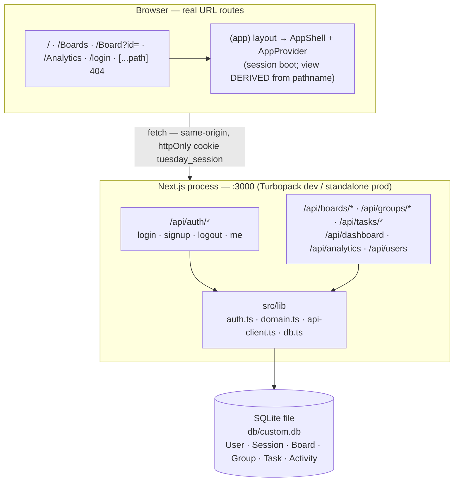
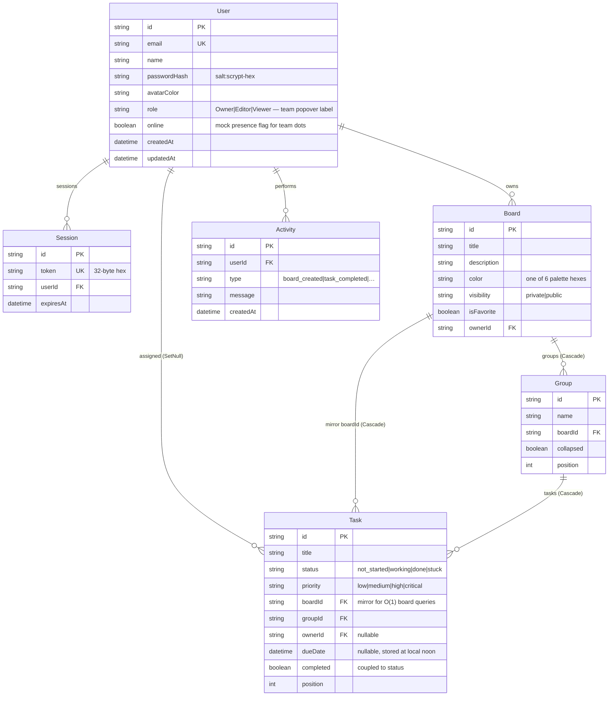

# Tuesday.com — Master Project Architecture Document (PAD) v1.15

**Classification:** Internal Engineering Reference
**Status:** DEFINITIVE, PRODUCTION-LOCKED BLUEPRINT
**Companion Documents:** `README.md` (onboarding), `AGENTS.md` (agent gotchas), `CLAUDE.md` (workflow contract)
**Last Updated:** 2026-09-22
**Audience:** Senior Engineers, Tech Leads, DevOps, and Onboarding Engineers
**Rule:** Every architectural decision in this document traces to a specific rationale.
           Nothing is here "because it's popular."

#### Revision Block — v1.15 (Second Platform-Login Redeploy: v3 Play-CDN Compile Semantics, Shadow/Blur Ports, Slate-400 Focus Ring, 2026-09-22)

- `[SYN]` Fifteenth pass (session 27,
  `docs/remediation-plan-session27.md`): the reference's platform login
  page was redeployed AGAIN (new `/static/index-BFhVa28D.js` +
  `index-D2_CMDc1.css`) — a rebuild with an IDENTICAL design (login +
  signup modes DOM-dumped; every class string matches the session-25
  port). The authed SPA is UNCHANGED (`/assets/index-BuEJAhK4.js`);
  fresh 5-pair VLM sweep 5/5 MATCH. The session-25 "platform page
  ports VERBATIM (no renames)" rule was **corrected in mechanism**: the
  platform page compiles under the **Tailwind v3 play CDN**
  (`cdn.tailwindcss.com` + `window.tailwind.config`), and the authed app
  is a **customized v4 build** pinning v3-era values (`.shadow-sm` =
  0 1px 2px 0.05, `.backdrop-blur-sm` = blur(4px)). The mislabeled rule
  had hidden three real value drifts on the login surface and one on the
  dashboard — all closed with TDD; post-fix computed-style equality
  verified live on every affected surface (button shadow, card blur,
  input ring, dashboard tiles).
- `[CSS]` **v3→v4 shadow/blur ports completed on the platform-login and
  dashboard surfaces** — login-view `shadow-sm` → `shadow-xs` (Sign in +
  Create account buttons + the Google button's hover) and
  `backdrop-blur-sm` → `backdrop-blur-xs` (the login card);
  dashboard-view `backdrop-blur-sm` → `backdrop-blur-xs` at the five
  sites (KPI icon tile, 3 gradient side cards, quick-action tile — 11
  rendered elements). A literal v3 `shadow-sm`/`backdrop-blur-sm` under
  our v4 build renders at DOUBLE the reference's value on BOTH compilers'
  surfaces (v3 CDN on the login page; the authed build's customized theme
  on the dashboard).
- `[UI]` **Platform-login focus ring fixed to slate-400** — Tailwind v4
  sorts `focus:` BEFORE `focus-visible:`, so the vendored Input base's
  `focus-visible:ring-ring` (near-black) beat the consumer's
  `focus:ring-slate-400` on every focused login/signup field (the v3 CDN
  resolves the same strings in class-string order, where slate-400 wins).
  The five consumer class strings now carry
  `focus-visible:ring-slate-400` (tailwind-merge drops the base's
  `ring-ring`, making slate-400 the ring color on every focus path);
  `rounded-sm` was audited and left alone (4px on BOTH compilers).
- `[GAT]` E2E 16→**21 specs**: new `e2e/parity.spec.ts` (5 computed-style
  parity contracts in the `expect.poll` tradition — login button resting
  shadow, Google hover shadow, card backdrop blur, focused input ring color
  via a same-page `text-slate-400` probe, signup-mode values, dashboard
  tile blur). Unit suite unchanged at 185; one in-loop spec correction
  (Chromium serializes v4's oklch colors as `lab(…)` in computed strings —
  assertions made color-space-neutral).

#### Revision Block — v1.14 (Reference Redeploy: Platform-Login Parity, Input/Textarea/Label Anatomy, v3→v4 Shadow + space-y Ports, 2026-09-22)

- `[SYN]` Fourteenth pass (session 25,
  `docs/remediation-plan-session25.md`): the reference was REDEPLOYED —
  but only its unauthenticated `/login` route (a new platform shell:
  `/static/index-CWZT4F4c.js` + `/static/index-CE8lozEC.css` + the Tailwind
  v4 RUNTIME + Google GSI). The authed SPA is UNCHANGED
  (`/assets/index-BuEJAhK4.js` — verified in the live DOM + served HTML),
  and a fresh 5-pair VLM sweep of the authed app re-confirmed 5/5 MATCH.
  The rebuilt login/signup surfaces were DOM-dumped and audited; the
  audit also caught two latent drift classes the old bundle hid: a
  systematic v3→v4 `shadow-sm` porting miss on 20 app-level sites and
  (deepest) Tailwind v4's `space-y` margin-direction flip collapsing
  every Label→field gap (vertical margins are inert on inline labels).
  All closed with TDD; post-fix login parity verified at computed-style
  equality (card 746 == 746px, field block 172 == 172px, label gap 10 ==
  10px) + VLM MATCH on login desktop/mobile and signup pairs.
- `[CSS]` **Tailwind v4 `space-y` semantics restored to v3 (the
  Label→field collapse)** — v4 applies margin-BOTTOM to
  `:not(:last-child)`; v3 applied margin-TOP to every child except the
  first. The (Radix) Label renders `display: inline`, and vertical
  margins are inert on inline boxes — so every form group shaped
  `<Label/><Input/>` rendered a 4px gap where the reference renders 12px
  (measured live on both apps' Create Board dialogs; login card 724 vs
  746px). Fix: `@layer utilities` overrides in `globals.css` restoring
  v3 semantics for every space-y value used here (0.5–8) plus the `sm:`
  variants — same `:where()` specificity as Tailwind's generated rules
  but AFTER them in the cascade, so consumer margin utilities still win.
  A CSS comment at the site documents the contract.
- `[CSS]` **v3→v4 `shadow-sm` port completed on app components** — the
  vendored primitives already honored the rename (v3 `shadow-sm` == v4
  `shadow-xs` computed), but 20 app-level sites ported from decompiled
  strings kept the literal `shadow-sm`, rendering at DOUBLE the v3
  value (nav: `0.1 0 1px 3px` vs the reference's `0.05 0 1px 2px`).
  All renamed (`header`, board sticky bars/toolbar/table card, boards
  toolbar, dashboard cards/quick-actions/badges, kanban count badge,
  calendar chip, search inputs); computed-equality verified live on the
  nav, toolbar card, and dialog fields.
- `[UI]` **Vendored Input/Textarea/Label locked to the OLD-shadcn
  anatomy** (same drift class as Card s11 / Badge+Switch s13 / Select
  s15 / Button s21): `px-3 py-1` input with a thin `ring-1` keyboard
  ring and v4 `shadow-xs`; textarea `px-3 py-2` with NO
  `field-sizing-content` (the v3 textarea never auto-grows); label
  `text-sm font-medium leading-none` without the NEW `inline`/
  `select-none`/`group-data-[disabled=true]` extras. Class constants
  exported (`INPUT_CLASS`/`TEXTAREA_CLASS`/`LABEL_CLASS`) and pinned by
  9 new contract tests in `primitives.test.ts`.
- `[UI]` **Board/create-task/create-group dialogs**: Create/Edit Board
  gained the reference's consumer overrides (input `h-12 rounded-xl
  border-[#E1E5F3] focus:ring-2 focus:ring-[#0073EA]/20`; textarea
  `min-h-20` + same) — the clone's fields were 36px/64px vs the
  reference's 48px/80px (original gap). The create-task/create-group
  raw `<input>` strings switched to the vendored Input; the Select
  trigger consumer dropped its `shadow-sm` override. Verified live:
  48px / 80px / 12px label gap / v3-equivalent resting shadow /
  `field-sizing: fixed`.
- `[AUTH]` **Platform signup parity** — the redesigned reference signup
  (no Full name; Back to sign in + "Create your account" + Email /
  Password / Confirm Password; h-10/sm:h-11 inputs with slate-400
  placeholders/icons; "Create account" submit; no logo/Google/footer)
  cloned verbatim; login mode refined to the platform anatomy (labels
  `leading-5`, inputs `py-2 shadow-none focus-visible:ring-2
  focus-visible:ring-offset-2`, Sign-in `gap-1` + ring-2/offset-2,
  Google button as a PLAIN button with the platform's exact class
  string + classic "G" svg paths). New pure seam `deriveSignupName`
  (email prefix → display name, "user" fallback) in `domain.ts`;
  `POST /api/auth/signup` accepts `{email, password}` (name optional —
  derived when absent). Client-side confirm-match validation feeds the
  existing inline alert; no request is sent on mismatch.
- `[GAT]` Unit suite 172→**185** (+9 Input/Textarea/Label contracts, +4
  `deriveSignupName`). E2E 13→**16 specs** (login surface structure,
  signup toggle round-trip, mismatch inline error — no account created,
  the DB stays at seed; one locator fix in-loop: `getByLabel("Password",
  { exact: true })`).
- `[OPS]` Fresh 15-surface dev-server screenshot set (the canonical 14
  + the redesigned signup surface) into `docs/screenshots/`;
  `.env.example` re-verified byte-identical (no new env vars).

#### Revision Block — v1.13 (Auth Rate Limiting — the §10 Open Medium Item Closed, 2026-09-22)

- `[SYN]` Thirteenth pass (session 23,
  `docs/remediation-plan-session23.md`): full re-verification first —
  workspace refreshed at `9e9f6ab` (operator's session_22 transcript, zero
  code delta), every session-21 marker re-confirmed in the tree, baseline
  gates green (lint 0 / tsc 0 / 160 unit / 12 E2E vs the standalone
  build), DB contract intact (repo-root `db/custom.db`, canonical seed),
  reference bundle unchanged (`index-BuEJAhK4.js`) — fresh 5-pair VLM
  sweep all MATCH (mobile-nav-open incl. hover, dashboard, boards, board
  table, analytics), mobile-nav hover re-probed at computed-style level in
  a `(hover: none)` context (both apps `rgb(225,229,243)`), kanban drag
  persistence re-smoked (coupling intact, seed restored). Then the one
  actionable finding — this repo's own tracked open item — was closed with
  TDD. Post-fix: **172 unit tests / 13 Playwright specs** green against
  the rebuilt artifact; live probes: 5×401 → 429 + `Retry-After: 900` +
  friendly message rendered inline in the login form; demo login +
  fail-then-succeed reset semantics verified; 400s never consume budget.
- `[SEC]` **Auth rate limiting delivered** (`src/lib/rate-limit.ts` +
  `src/lib/rate-limit.test.ts`, 12 contract tests, red-first): in-memory
  `createRateLimiter({ windowMs, max, maxKeys })` — fixed window from the
  FIRST failure, failures-only counting on login (successes `reset` the
  key, so transient typos never lock a legitimate user out and the E2E
  suite's ~6 successful demo logins per run never trip it), every parsed
  POST counts on signup (creation is the guarded action: enumeration
  oracle + spam + scrypt on the happy path), expired entries pruned on
  every check, map capped at `maxKeys` (default 10 000) against
  key-rotation memory growth. Wired into `POST /api/auth/login` (key
  `login:${ip}:${email}` — per-email+IP exactly as §10 worded it; gate
  BEFORE the scrypt work) and `POST /api/auth/signup` (key
  `signup:${ip}`); blocked requests get 429 + `Retry-After` + the
  ActionResult envelope (the api-client flows any status's envelope, so
  the login form renders the message inline — zero client changes). IP
  extraction: `x-forwarded-for` first hop → `x-real-ip` → `"unknown"`
  (proxy must sanitize the header — `docs/DEPLOYMENT.md`). In-memory is
  deliberate: the app is a single Next.js process (§2); a restart merely
  clears failure counters while the Session table remains the durable
  auth state. Bounds are module constants (`LOGIN_RATE_LIMIT` 5/15 min,
  `SIGNUP_RATE_LIMIT` 10/15 min) per the "no speculative knobs" rule —
  pinned by the unit suite + the new E2E spec. Regression-pinned by
  `e2e/auth.spec.ts` (unique throwaway email → 5×401 → 429 + header +
  message; isolated from the demo account's budget by key design).
- `[GAT]` Unit suite 160→172 (12 rate-limit contract tests: under-max
  allowed, blocked-at-max with retryAfterSec, check-never-counts,
  per-key isolation, window expiry, fixed-from-first-failure, retryAfter
  math, reset semantics, pruning, maxKeys eviction, fresh-window-after-
  expiry). E2E 12→13 specs (the login rate-limit regression). §7.1's
  stale unit-test subtotal corrected in the same pass (145→149 for
  domain+primitives; the v1.12 total of 160 was already correct).
- `[OPS]` Screenshots re-captured on the remediated codebase (fresh
  14-surface dev-server set into `docs/screenshots/`); `.env.example`
  re-verified byte-identical to the working `.env` (no new env vars — the
  limiter's bounds are module constants).

#### Revision Block — v1.12 (Hover Variant, DB Path Contract, Button Anatomy, Playwright E2E, 2026-09-22)

- `[SYN]` Twelfth pass (session 21,
  `docs/remediation-plan-session21.md`): operator brief pointed at the
  mobile navigation menu ("look out for a possible TailwindCSS v4 related
  bug") — reproduced, root-caused, and fixed; the database-location
  contract from the operator's `.env.example` spec commit (`8a680df`) was
  implemented (`src/lib/db-path.ts` + `tests/db-path.test.ts`); the
  Playwright golden-path suite landed (PAD §7.2's tracked "next" step);
  the vendored Button joined the OLD-shadcn anatomy lock. Post-fix
  verification: lint 0 / tsc 0 / **160 unit tests** / **12 Playwright
  specs** green against the standalone production build / fresh 14-screenshot
  set / VLM 3-for-3 MATCH (mobile menu open with hover applied, dashboard,
  boards) / kanban drag + reload persistence re-smoked.
- `[CSS]` **Tailwind v4 hover-variant media guard removed (the mobile-menu
  bug)** — Tailwind v4 wraps every `hover:*` utility in
  `@media (hover: hover)` (the v3.3 `hoverOnlyWhenSupported` future flag
  became the default); the reference's v3-compiled CSS applies plain
  `:hover` unconditionally (verified in its stylesheet). On
  `(hover: none)` devices the clone's hover/tap feedback was dead — the
  hamburger matched `:hover` with a transparent computed background
  (reproduced live 2026-09-22). Fix: `@custom-variant hover (&:hover);` in
  `globals.css` restores v3 behavior for ALL ~150 hover utilities;
  `group-hover` is NOT media-guarded in v4 (verified in the compiled CSS)
  and needed no change. Regression-pinned by
  `e2e/mobile-nav.spec.ts` (a `hasTouch: true` context — the exact
  environment where the pre-fix CSS provably failed; red before the fix,
  green after).
- `[DB]` **Database-location contract implemented** — Prisma 6.19.2
  resolves a relative `file:` URL from `.env` against the .env/CWD
  location, so `file:../db/custom.db` landed the database in the PARENT
  directory of the repo (reproduced: CLI, seed, and dev runtime alike).
  New pure module `src/lib/db-path.ts` (`resolveDatabaseUrl`) anchors
  relative `file:` URLs at the repo's `prisma/` directory — located by
  walking up from the process CWD and the module's own directory, SKIPPING
  build-output anchors (`.next/…` — Next's standalone server `chdir`s into
  `.next/standalone`, which contains a TRACED copy of the schema; without
  the skip the DB lived inside the disposable build). Wired into
  `src/lib/db.ts` (datasources override), `scripts/seed.ts`, and
  `scripts/prisma-cli.ts` (the `db:push`/`db:migrate`/`db:reset` wrapper
  that overrides DATABASE_URL with the resolved absolute URL). Contract
  pinned by `tests/db-path.test.ts` (11 tests; `tests/` un-ignored in
  `.gitignore` per the operator's spec). Verified end-to-end: fresh
  push+seed lands `db/custom.db` in the repo, login round-trips, and the
  standalone production build reads/writes the SAME file (mutation probe
  changed only the repo file's mtime).
- `[UI]` **Vendored Button rewritten to OLD-shadcn anatomy** (same drift
  class as the session-11/13/15 Card/Badge/Switch/Select fixes — the
  Button had been audited only for an at-rest gap): `transition-colors`,
  thin `focus-visible:ring-1 ring-ring` keyboard ring (the NEW anatomy's
  `ring-[3px] ring-ring/50` + `focus-visible:border-ring` differed on
  every keyboard-focused surface), OLD sizes (`h-9 w-9` icon), no
  dark-mode/aria-invalid extras, v3→v4 shadow renames on
  default/outline/destructive/secondary. Locked by six new
  `primitives.test.ts` contract tests (red against the NEW anatomy
  first). Consumer overrides (`h-10 w-10 rounded-lg hover:bg-[#E1E5F3]`,
  login's `h-11 w-full rounded-xl …`) merge over the plain utilities
  exactly like the reference's.
- `[GAT]` Unit suite 143→160 (TDD, red-first): 11 db-path contract tests
  (schema-directory anchoring, nested start dirs, build-output skip,
  absolute/postgres passthrough, default fallback) + 6 Button anatomy
  contract tests. **Playwright E2E suite delivered** (`playwright.config.ts`
  + `e2e/` — Chromium, webServer = the standalone production artifact,
  `reuseExistingServer`): auth golden path (+ invalid credentials +
  from_url redirect), board golden path (boards list → open board →
  status-pill round-trip persisted across reload, seed state restored),
  mobile navigation (panel content, the hover-variant regression,
  tap-navigation closing the panel), and the route surface
  (case-insensitivity, 404, back/forward).
- `[OPS]` `db:seed` hardened: a rejected `$disconnect` no longer fails an
  otherwise-successful run (SQLite contention with a live dev server was
  exiting 1 AFTER printing the counts), and P2021 renders an actionable
  "run `bun run db:push` first" message. `docs/DEPLOYMENT.md` created
  (absolute-path guidance the `.env.example` cites).

#### Revision Block — v1.11 (Parity Deep-Pass #9: System Font, Select Anatomy, Mock Chrome, Date Boundary, 2026-09-19)

- `[SYN]` Eleventh parity pass (session 15,
  `docs/remediation-plan-session15.md`): bundle still unchanged
  (`index-BuEJAhK4.js` — every prior decompiled spec remains valid);
  controlled experiment re-run ("S14 Probe Board", 10 tasks, 3 owners +
  2 unassigned, dates Sep 14–Oct 10) on BOTH apps; 12 view pairs captured
  and VLM-compared twice (the first run exposed a probe-seeding bug —
  the clone's createTaskSchema is title+groupId only, so statuses/
  priorities/owners/dates must be PATCHed after create, exactly like the
  reference's inline-edit flow). Final convergence: 5 direct MATCH
  verdicts + 7 DIFF verdicts fully triaged (data-only, documented
  deliberate deviations, disproven VLM hallucinations, one capture-path
  artifact — lowercase `/boards` vs canonical `/Boards` — re-captured
  canonically and re-verified MATCH).
- `[UI]` **Systemic font gap closed** — the reference ships Tailwind v4's
  DEFAULT system font stack (`ui-sans-serif, system-ui, …`; zero
  `@font-face`, empty `document.fonts`, body NOT antialiased). Our Inter
  `next/font` override produced different glyph metrics (calendar chips
  truncated one character later; table titles wrapped at different
  points → different row heights). Inter import and `--font-sans`
  override deleted; `<body>` drops `antialiased` (reference smoothing is
  `auto`). This also removes the Google-Fonts network dependency from
  `next build`.
- `[UI]` **Vendored Select rewritten to OLD-shadcn anatomy** (same drift
  class as the session-11/13 Card/Badge/Switch fixes): plain `h-9 w-full`
  trigger utilities (no `data-[size=default]:h-9` attribute variant) so
  consumer `h-full`/`h-auto`/`w-48` merge away in `cn()` exactly like
  the reference — the priority/status cell triggers now follow their
  cell height and every table row matches the reference's geometry
  (~5px shorter). Item/Label/Separator/Chevron ported to the decompiled
  strings (v3→v4 renames applied); `SELECT_TRIGGER_CLASS` /
  `SELECT_ITEM_CLASS` exported and locked by `primitives.test.ts`.
- `[UI]` **Board-table title cell** — the reference's title cell carries
  NO `text-size` class (inherits 16px/24px — what makes 2-line titles
  65px tall) and rounds only on hover; our `text-sm w-full rounded`
  version produced uniformly shorter rows.
- `[UI]` **Mock chrome parity** — the reference hardcodes header avatar
  letter "U" (desktop w-8 + mobile w-10), mobile panel placeholder texts
  `User Name` / `user@example.com`, and a four-member mock team
  (JD/JS/MJ/SW with position colors, pulsing presence dots, per-avatar
  tooltips `"name (role)"`, ONE row-level members popover). The clone now
  renders the same mock chrome (`TEAM_MEMBERS` const in board-view.tsx);
  `board.members` and the users API stay untouched.
- `[LOGIC]` **Date-cell overdue boundary** — the reference's decompiled
  rule renders the red chip only when `due < now &&
  due.toDateString() !== now.toDateString()` (today NEVER red). New pure
  seam `isOverdueDate(date, now?)` in domain.ts replaces the naked
  `date < new Date()` comparison (which turned every task due today red
  after local noon). The Board Analytics overdue COUNT keeps the
  guardless comparison — matching the reference.
- `[UI]` **Boards grid card placeholder** — "No description provided."
  (the list row keeps the plain "No description") — decompiled strings.
- `[GAT]` Unit suite 131→143 (TDD, red-first — 12 failing tests before
  implementation): `isOverdueDate` boundary tests (yesterday red,
  today-noon NOT red, today-23:59 NOT red, future plain) + Select
  anatomy contract tests (trigger/item markers, exported constants).

#### Revision Block — v1.10 (Parity Deep-Pass #8: Primitive Anatomy Convergence, 2026-09-18)

- `[SYN]` Tenth parity pass (session 13,
  `docs/remediation-plan-session13.md`): a fresh drift sweep re-ran the
  controlled experiment on BOTH apps (throwaway "S12 Probe Board", 10
  tasks, 3 owners + unassigned), captured 12 view pairs, and VLM-compared
  them — 11 MATCH on the first pass. The single verdict difference
  triaged to a probe-tooling artifact (the local seed script resolved
  owners by reference-side names that don't exist in the clone's user
  table), NOT an app gap: the Team Workload panel was live-verified in
  BOTH states (renders with owners on Website Redesign; hidden on
  owner-less boards exactly like the reference's Product Launch).
- `[UI]` **Two systemic vendored-primitive gaps closed** — the reference
  ships OLD shadcn/ui primitives while two of our vendored files still
  carried the 2024 "new shadcn" anatomy (sub-perceptual diffs every
  prior VLM pass missed; caught this cycle by computed-style ground
  truth + bundle decompilation):
  `ui/badge.tsx` — base `px-2.5 py-0.5 font-semibold` (was px-2/
  font-medium → computed 2px 10px + weight 600 like the reference;
  consumer `px-2.5 font-semibold` overrides in the integrations/
  automations dialogs are now redundant), default/destructive gain the
  reference's v3 `shadow` (ported as v4 `shadow-sm`), outline stays
  `text-foreground`.
  `ui/switch.tsx` — track `h-5 w-9 border-2` + thumb `h-4 w-4
  shadow-lg translate-x-4` (was `h-[1.15rem] w-8` border-1 + calc
  translate: checked thumb 15px→18px from track left, matching the
  reference exactly; the integrations/automations `h-5 w-9` color
  overrides remain and are now redundant).
- `[GAT]` Unit suite 120→131 (TDD, red-first — 11 failing contract tests
  before implementation): new `src/components/ui/primitives.test.ts`
  locks the decompiled anatomy of all four Badge variants and the Switch
  track/thumb constants so dependency refreshes cannot silently drift
  the geometry. Progress bar and modal Configure buttons were
  computed-verified IDENTICAL — untouched. Button base left as-is (only
  focus-ring/transition diffs at rest; every live surface previously
  verified).
- `[VER]` All 12 VLM view pairs now converge (modal-analytics,
  modal-integrations, modal-automations re-captured post-fix and
  re-compared — MATCH). Reference restored to pristine (1 board / 1
  item, all entity deletions 200); clone restored to the canonical
  4-board seed state.

#### Revision Block — v1.9 (Parity Deep-Pass #7: Board Modals, Card Anatomy, Analytics Ordering, 2026-09-18)

- `[SYN]` Ninth parity pass (session 11,
  `docs/remediation-plan-session11.md`): 12 gaps closed after a fresh
  drift sweep that first verified **zero reference bundle drift**
  (`/assets/index-BuEJAhK4.js` byte-identical to the session-9
  decompilation) and re-ran the controlled experiment (throwaway board +
  10 seeded tasks via the base44 entities API; every candidate verified
  against live DOM, pixel reads, and the bundle; artifacts deleted at
  delivery). **Three board-header modals discovered and built** — the
  header's Analytics button does NOT navigate to /Analytics: it opens the
  reference's **Board Analytics modal** (`Ote` — new
  `board-analytics-dialog.tsx`, `max-w-6xl max-h-[90vh]`): three gradient
  stat cards (Total Tasks blue, Completion Rate green + inline `Progress`,
  Overdue red = dueDate < now && status ≠ done), Status Distribution in
  VOCABULARY order (zero counts included — the modal iterates the column's
  choices, unlike the site page), Team Workload (first-encounter top-5,
  solid-blue initial avatars, hidden when no owners), Recent Activity
  (top-5, "MMM d, HH:mm" 24-hour stamps, hidden when no tasks) — computed
  over the board's **UNfiltered** task set. **Integrate** opens the
  **Integrations Center** (new `integrations-dialog.tsx`, `max-w-4xl`,
  sticky header, blue banner, 8 brand-tiled cards — Slack #4A154B, Drive
  #4285F4, GitHub #181717, Figma #F24E1E, Zoom #2D8CFF, Jira #0052CC,
  Shopify #7AB55C, HubSpot #FF7A59 — shadcn Switch `h-5 w-9` green-500,
  Configure buttons inert like the reference). **Automate** opens the
  **Automations Center** (new `automations-dialog.tsx`, purple banner,
  "Create Custom Automation" primary button + 5 recipe cards with the
  same switch/tile anatomy). All three dialogs are conditionally mounted
  so their local-state switches RESET on close — verified against the
  reference's reset-on-reopen behavior.
- `[SYN]` **Systemic Card anatomy re-aligned to the reference's OLD
  shadcn style** (`ui/card.tsx`): CardHeader `flex flex-col space-y-1.5
  p-6`, CardContent `p-6 pt-0`, CardFooter `flex items-center p-6 pt-0` —
  measured live, the vendored new-style card put a 24px gap between
  header and content where the reference has 0px (dashboard side cards,
  analytics cards). `ui/label.tsx` aligned to the old inline-block style
  (all consumers are plain text labels). Dashboard Recent Boards:
  "View All" is a `/Boards` Link wrapping a ghost Button (`h-9 px-4 py-2
  text-[#0073EA] hover:bg-[#0073EA]/10` + ArrowRight), visibility badges
  became shadcn Badges with GRADIENT fills (orange→red private /
  green→emerald public), board rows became real `/Board?id=` anchors with
  hover borders and a chevron that turns blue. Recent Activity: top-5
  (`take: 5`) in a `space-y-3` wrapper. Login: the Google button + OR
  divider + form now nest inside ONE `w-full` column wrapper (OR→Email
  gap 28px, verified pixel-exact) and the Google button is a 54px plain
  button (`h-auto` overriding shadcn `h-9`). Timeline task rows: the
  reference's anatomy — 32px `flex border-b` rows, static `w-[200px] p-2
  border-r text-xs truncate` labels (no dots, no sticky), ONE
  `flex-grow relative h-full` body per row (no per-day cells or column
  borders in rows). Toolbar Sort trigger icon: `arrow-up-narrow-wide`.
- `[GAT]` Unit suite 106→120 (TDD, red-first — 14 failing tests before
  implementation): five new pure seams — `distributionEntries`
  (first-encounter counts, zero-omission), `teamWorkload` (cap 5),
  `recentActivityItems` (top-N updatedAt-desc), `boardStats`
  (total/done/rate/overdue), `formatBoardActivityTime` (24-hour).
  Analytics API now loads tasks `updatedAt desc` and builds status +
  priority distributions in FIRST-ENCOUNTER order with zero-count rows
  omitted; board-performance rows follow board-array order (no rate
  sort) — all three decompiled from the reference and verified live
  (board-filtered view renders only encountered statuses).
- `[DEV]` Deviations updated (§10): the reference's custom modals do not
  close on Escape (ours do — Radix Dialog, strictly better a11y, no
  visual change); the reference's switch toggles/Configure/Customize
  are non-persisting mock UI (ours mirror: local state, inert buttons);
  the reference's Priority Distribution section in the BOARD modal is
  dead code (reads a `type:"priority"` column no current board has) —
  not replicated; boards-page Analytics remains our real /Analytics
  route (the reference's is a dead external `https://analytics/` link).

#### Revision Block — v1.8 (Parity Deep-Pass #6: Interactive Surfaces, 2026-09-17)

- `[SYN]` Eighth parity pass (session 9, `docs/remediation-plan-session9.md`):
  19 gaps closed after a **bundle-decompiled + rich-data-probed** drift sweep.
  Because the reference's live data is sparse (1 board / 1 task), the sweep
  created a throwaway board on the reference and seeded 10 tasks via the
  base44 entities API (all statuses/priorities, 3 string owners +
  unassigned, dates across Sep 15 – Oct 10), then verified every multi-task
  state against the reference's compiled JS (`/assets/index-BuEJAhK4.js`,
  decompiled component-by-component: `hZ` OwnerCell, `pZ` DateCell, `fZ`
  StatusCell, `xZ/wZ` PriorityCell, `bZ` row, `RZ` Person filter, `TZ`
  Filter, `_Z` Sort, `AZ` Hide, `MZ` Group-by, `bte` KanbanCard, `Ste`
  Kanban, `kte` Timeline, `pA` Edit-Task modal). **Edit Task modal** added
  (new `edit-task-dialog.tsx`): `sm:max-w-2xl max-h-[80vh]` dialog opened
  from kanban cards, their Ellipsis buttons, and calendar chips — Task
  Title + two-column grid (Priority/Status selects, Owner free-text, Due
  Date calendar popover with PPP labels) + `pt-4 border-t` footer (Delete
  Task behind `window.confirm` | Cancel + Save Changes). **OwnerCell**
  rewritten to the reference's free-text anatomy (bare inline input,
  commit blur/Enter, Escape cancel, solid-blue 24px FIRST-LETTER avatar);
  typed names resolve to member accounts. **Status/Priority cells** became
  real shadcn Selects (pill→Select swap for status; badge-in-trigger for
  priority) with color-dot items and near-black checks. **Group header**
  now renders per-status count dots in FIRST-ENCOUNTER order
  (`statusHeaderDots`); the **footer** caps priority badges at three with a
  `+N` overflow (`groupSummary` gained `overflowCount`). **Toolbar** menus
  restyled to the reference's card anatomy (w-64, `text-lg font-bold`
  title + X close) — Sort lists ALL seven fields with an asc⇄desc toggle
  (no off state) and its trigger always reads "Sort"; the Person filter is
  multi-select over the board's distinct owners with blue first-letter
  avatars and a red "Clear selection"; Filter's priority rows lost their
  dots; Hide gained Eye/EyeOff rows + "Show all columns"; Person/Filter/
  Hide buttons carry blue count badges. **Kanban**: card owner avatars are
  the reference's 8-gradient palette indexed by `charCodeAt(0) % 8` with
  `substring(0,2)` initials (JO/JA/MI verified against the live
  reference); People columns list only owners who own tasks (LE-palette
  badges, conditional Unassigned column, no header avatar/sublabel); drag
  visuals became `ring-4 ring-blue-200 scale-105` + column-color-tinted
  drag-over gradients; the overdue date-chip variant was dropped (the
  reference's chip is always blue). BOARD_COLORS renamed to the live
  dialog's "Warning Orange"/"Teal" labels.
- `[GAT]` Unit suite 87→106: `avatarGradient`, `avatarInitials`,
  `statusHeaderDots`, `distinctOwnerNames`, `PEOPLE_COLUMN_PALETTE`,
  extended `sortTasks` (4 new fields + nulls-last), `filterTasks`
  (`personIds` array), `groupSummary` (order + cap + overflow), updated
  `BOARD_COLORS` labels (TDD: red first — 21 failing tests before
  implementation). Fixed a pre-existing wiring bug: the default-grouping
  table now sources rows from the SORTED `visibleTasks` (the Sort menu
  previously never reordered rows inside real groups).
- `[DEV]` Deviations updated (§10): the reference's timeline bars NEVER
  render on current boards (its bar component reads a literal
  `data.startDate` key that no current column model produces — verified
  live with 10 dated tasks; bars appear only after API-injecting
  startDate/endDate; spec captured: 28px rounded, board-color, 0.9
  opacity, 40px/day); the reference's analytics priority distribution
  counts its server-default top-level `priority` field (all "medium") and
  its dashboard "Completed Tasks" KPI reads a different completion source
  than its analytics (0 vs 2) — both root-caused; owner commits resolve to
  real member accounts (reference stores arbitrary strings).

#### Revision Block — v1.7 (Parity Deep-Pass #5: View Geometry & Structure, 2026-09-17)

- `[SYN]` Seventh parity pass (session 8, `docs/remediation-plan-session8.md`):
  5 verified gaps closed after a full 10-view drift sweep (VLM + DOM probes +
  pixel reads; the recurring "black N button" flag was identified as the
  Next.js dev toolbar, a dev-mode-only artifact absent from production).
  **Calendar grid geometry**: the day grid moved INSIDE the card's single
  `p-4` zone (it previously sat outside, spanning the full card width and
  starting 16px lower) and its container gained `grid-rows-5 gap-px` — the
  1px gaps show the card's white between each bordered cell pair, producing
  the reference's double-hairline grid lines (pixel-verified identical);
  columns now compute to exactly 7×193.141px like the reference.
  **Login card structure**: padding moved to an inner `p-8 sm:p-10
  md:pt-12 md:pb-10 md:px-10` div; one `space-y-6 sm:space-y-8` column holds
  every section (logo, title, Google in a `w-full > space-y-3` wrapper, OR
  divider in its own `w-full` wrapper — without it the line shrinks behind
  the chip — form, in-form footer); the Google icon rides in a `-ml-4`
  wrapper; the OR divider uses slate literals (`h-[1px] bg-slate-200` line,
  `bg-white px-3 text-slate-500 font-medium tracking-wider` chip); the form
  is `space-y-4 sm:space-y-5` with `space-y-3 sm:space-y-4` fields,
  `pl-10` inputs, `text-slate-700` labels; "Need an account? Sign up" is
  ONE button with a font-medium slate-700 span. **Dashboard greeting
  card**: deco circles removed; icon row is `flex items-center gap-3 mb-3`
  with a separate card-level `flex flex-wrap gap-3 mt-6` buttons row
  wrapped in real `Link` anchors (`/Boards`, `/Analytics`); primary button
  `px-5 rounded-xl font-medium shadow-lg hover:shadow-xl`, secondary
  `border-2 border-[#E1E5F3] hover:border-[#0073EA] hover:bg-[#0073EA]/5`.
  **Timeline**: zoom is the reference's NATIVE `<select>`
  (`h-8 border-gray-300 rounded-md px-2 text-sm`) in a `gap-1` toolbar;
  month-mode columns are a fixed `w-[171.43px]` (the reference's computed
  1200/7, viewport-independent); day cells always stack weekday-over-number
  with `border-r` on every column and inherited near-black numbers; the
  day-header row renders even with zero scheduled tasks, followed by the
  `p-8 text-center text-gray-500` empty message. **Kanban column**: the
  dnd-kit droppable ref moved onto the `w-80` column div itself (no inner
  `flex flex-col` wrapper — the column's two direct children are the
  `px-4 py-3 mb-2` header zone and the scroll zone, like the reference);
  plain `text-lg font-bold` column titles; `.tuesday-scroll` (kanban-only)
  updated to the reference's `custom-scrollbar` spec (8px bar, transparent
  10px-radius track, slate-300→400 gradient thumb + 1px slate-200 border,
  hover slate-400→500).
- `[GAT]` No new domain seams — all five gaps are presentational (JSX/CSS);
  the 87-test suite stayed green throughout and is the regression gate.
- `[DEV]` Deviations updated (§10): the reference's unassigned view renders
  an empty content area even when unassigned tasks exist (broken owner
  filter — ours lists them); the reference silently drops dateless tasks
  from the timeline (ours keeps a reachable section); the reference's
  day-mode zoom renders 5.71px cells (40/7 — a defect; ours keeps a usable
  single wide column).

#### Revision Block — v1.6 (Parity Deep-Pass #4: Reference Drift & Token Architecture, 2026-09-17)

- `[SYN]` Sixth parity pass (session 7, `docs/remediation-plan-session7.md`):
  18 numbered gaps closed after re-probing the live reference. **Nav active
  state is NEW reference drift** — the reference now highlights the current
  route's link (`bg-[#E1E5F3] text-[#0073EA]`, desktop AND mobile) on an
  exact, case-sensitive `pathname === href` match, so `/Boards` highlights
  "My Boards" while `/`, `/Board?id=`, and lowercase rewrites highlight
  nothing (`isNavActive` seam; the v1.4 "no active highlight" invariant is
  obsolete). The **mobile menu is an inline collapsible panel** under the
  header (not a Sheet): nav links, a `search-mobile` field, a user section
  (40px gradient avatar, name/email, bell), and three footer links; the
  hamburger is a `h-10 w-10` ghost on the RIGHT whose icon swaps Menu↔X.
  Header user avatar is the 32px `bg-gradient-to-r from-[#0073EA]
  to-[#00C875]` circle; the user menu is a plain "My Account" label +
  separator + three standard-color items. **Team row + popover** re-architected
  to the reference's hardcoded-team anatomy: three position-colored avatars
  (`bg-blue/green/purple-500`, hover scale-110, `+N` `bg-gray-400` overflow)
  with `bg-green-400` 1px-border presence dots driven by the new
  `User.online` flag; a `w-80` "Team (N)" popover with Invite button and
  member rows (id-mod-3 avatar colors via `memberPopoverPalette`, role from
  the new `User.role` column, Mail/MessageSquare ghost buttons). Board table:
  task-row rails carry `bg-white group-hover:bg-[#F5F6F8]` classes (handle
  rail adds zone-level `cursor-grab opacity-0 group-hover:opacity-100 p-1`),
  the action rail gains `border-l border-[#E1E5F3]`, the row action is a
  small `Trash2 w-3 h-3 text-[#676879]` dropdown trigger (single
  standard-color "Delete Task" item), the add-task row is fully transparent
  with a `flex-1` title zone, and the **summary row aggregates** Owner
  (Users icon + "N people") and Date (Calendar icon + "Sep 25" / "Sep 18 -
  Sep 25" range; `summaryDateLabel`/`summaryOwnerLabel` seams). OwnerCell
  renders the reference affordances ("Assign" / hover-fade blue-avatar
  state). Calendar: dynamic week count (`calendarCells` — 35 cells for Sep
  2026), bare number spans, `mt-1 max-h-[70px]` scrollable event lists,
  solid out-month `bg-[#F9FAFB] text-gray-400`, weekday row
  `text-[#676879] mb-2` with `border-b` cells, no per-cell add button.
  Kanban aligned to the reference DOM: bare `flex gap-6 p-2 pb-8` scroller
  (no outer card), `w-80` shadow columns with slate-gradient backgrounds,
  `Ellipsis` icons (3 dots), dashed-border empty-column hints. Board-title
  edit input matches the reference (`border-input h-8 w-64` spec).
- `[TOK]` **Token architecture realigned**: the reference keeps shadcn's
  neutral defaults and hardcodes every blue — the clone now does the same.
  `--primary` is near-black `hsl(0 0% 9%)` (checkbox checked state renders
  `#171717`), `--foreground`/`--card-foreground`/`--popover-foreground` are
  `hsl(0 0% 3.9%)` (inherited button labels/calculator numbers render
  `#0a0a0a`), `--accent`/`--secondary` `hsl(0 0% 96.1%)`, `--ring`/`--border`/
  `--input` `hsl(0 0% 3.9% / 89.8%)`, `--muted-foreground` `#676879`; ~27
  app-level `text/border/ring-primary` usages converted to explicit
  `#0073EA`. ⚠ Tailwind v4 passes raw `var()` values through — token values
  must be complete `hsl(…)` colors, never bare `0 0% 9%` triples.
- `[GAT]` Unit suite 69→87 tests: `isNavActive`, `calendarCells`,
  `summaryDateLabel`, `summaryOwnerLabel`, `teamAvatarPalette`,
  `memberPopoverPalette` seams (TDD: red first). `UserDTO` gained
  `role` + `online` (schema + seed + all API selects; seed mirrors the
  reference's mock team mix — one Owner, two Editors, one offline Viewer).
- `[DEV]` Deviations updated (§10): reference row-trash delete is
  client-side-only (ours keeps the real API); reference user-menu items are
  dead `/Board` links (ours toasts "not available"; Sign out works);
  reference never updates SPA titles; `/Board` without id hangs on the
  reference (ours renders the not-found card); team data is real users, not
  the reference's hardcoded mock members.

#### Revision Block — v1.5 (Parity Deep-Pass #3: Routing & Chrome, 2026-09-17)

- `[SYN]` Fifth parity pass (session 6, `docs/remediation-plan-session6.md`):
  30 numbered gaps closed. **Real URL routes** now mirror the reference —
  `/` (+`/Dashboard` rewrite) dashboard, `/Boards` boards list,
  `/Board?id=<entityId>` board detail (sub-views stay client state — URL
  never changes, like the reference), `/Analytics`, `/login` (renders the
  form even when authed), and a server-rendered `[...path]` catch-all with
  the styled slate 404 (per-route titles `… | Task Management`, titlecased
  from the last path segment). Authed surfaces live in an `(app)` route
  group whose `AppShell` layout boots `/api/auth/me` and redirects logged-out
  users to `/login?from_url=<original>` (open-redirect-guarded, returns after
  sign-in); login/404 render bare outside the shell. `next.config.ts`
  rewrites make paths case-insensitive. Shell re-architected to the reference
  shape: `flex min-h-screen flex-col` with `main.flex-1.overflow-y-auto` and
  nav classes `bg-white border-b border-[#E1E5F3]` + `max-w-full` gutters.
  **Board chrome**: gray sticky wrapper (`top-0 z-20 pb-4`) around the
  full-width white bar (`top-16 z-40`); one-row header (back-arrow anchor +
  tile + title-over-subrow; `h-8` Analytics/Integrate/Automate with colored
  hover borders; avatar row); constant-`Table2` trigger `h-6 px-2 text-xs
  #676879`; favorite pill (favored `#ca8a04` fill-current); meta
  `text-[#A0A0A0]`; toolbar one left-packed row (New Task `h-10 #0073EA`,
  search `w-64 bg-[#F5F6F8]`, outline controls `h-10 px-4`); content zone
  `px-6 py-6`. The blue `h-1` header strip is a **binary has-scrolled
  marker** (scaleX(0) at rest → full width at `window.scrollY ≥ 32`, probed
  live; the page scrolls on the BODY — main's `overflow-y-auto` is inert on
  `min-h-screen` pages, matching the reference exactly).
- `[SYN]` View surfaces: kanban Group-by Select gains the `List` icon +
  `border-2 border-gray-200 rounded-xl` trigger; calendar today cell adds
  `ring-2 ring-[#0073EA] ring-inset`; analytics completion fill is near-black
  `#171717` on `bg-green-300`, revealed by `translateX(-{100−value}%)`
  (invisible at 0%). Boards page: Favorites filter replaced by the
  reference's inert **Filter** button (`h-10 px-3 border-[#E1E5F3]`, funnel
  icon `mr-1.5`); card timestamps drop the favorite star and add the
  `Calendar` icon `w-3.5 h-3.5`. Dashboard: reference KPI cards
  (`group perspective-1000` gradient buttons, deco discs, 6 hover particles
  at fixed positions, shine sweep, hover ring, white/20 backdrop-blur icon
  tiles, LEFT-aligned text), hero `Sparkles` tile + `p-6 md:p-8`, gradient
  side cards (`to-{indigo|purple|green}-50/30`) with `flex` headers and
  w-12 gradient tiles, quick-action gradient rows (blue→cyan / green→emerald
  / amber→orange / purple→pink), visibility badge in the right zone;
  **Recent Activity now lists recently-updated tasks** (clock tile, title,
  `Sep 17, 1:36 AM` via `formatRecentTaskTime`) — `/api/dashboard` returns
  `recentTasks` (top 6 by `updatedAt`). Login: `bg-slate-900` h-12
  `rounded-xl` text-only sign-in, `h-11 sm:h-12` `bg-slate-50/50` inputs,
  split footer links (slate-500/700, no blue), no tagline line.
- `[GAT]` Unit suite 61→69 tests: `ROUTE_PATHS`, `notFoundTitle`, and
  `formatRecentTaskTime` seams (TDD: red first). `DashboardDTO.activity`
  (event log) replaced by `DashboardDTO.recentTasks`; `ACTIVITY_TYPES`
  removed from the client contract (the Activity table still records events
  server-side).
- `[DEV]` Deviations updated (§10): the boards-page Filter button now MATCHES
  the reference (inert) instead of our functional Favorites filter;
  favorites remain toggleable from the board header (the reference surface
  where stars do work); browser back/forward now works (real routes) — that
  §10 row is closed.

#### Revision Block — v1.4 (Parity Deep-Pass #2, 2026-09-17)

- `[SYN]` Fourth parity pass. Session 4's probes mislabeled several surfaces;
  this pass re-derived the ground truth with fresh computed-style DOM probes
  and controlled (fully reverted) experiments on the reference. 34 numbered
  gaps closed (`docs/remediation-plan-session5.md`): **groups now own their
  accent colors** (`Group.color`, seven `GROUP_COLOR_OPTIONS` swatches
  including Gray `#676879`, Add New Group dialog, 4px border-left per group
  instead of board color); board table re-architected as **one white card**
  wrapping all groups with per-group horizontal scroll, sticky rails (handle
  24/left-0, checkbox 32/left-24, Task 250/left-56, action 50/right), sticky
  column-header band with per-column settings menus + blue add-to-group plus,
  hover-revealed grey "+ Add task" row button (the dashed blue button belongs
  to Add New Group only), bordered summary-row chips, empty-group "Add Item"
  flow, row-click collapse, single-item "Delete Task" row menu; sticky board
  header + scroll progress bar; toolbar in a white card; Create Task dialog
  `sm:max-w-lg` h-12 inputs with group color dots; kanban cards with FIXED
  neutral `#E1E5F3` left border (not status-colored), date chip + gradient
  avatar footer, no priority badge; calendar p-4 header with flanking arrows +
  centered text-xl title, `min-h-[100px]` bordered cells, blue-text today
  marker, white bordered event chips; timeline title-left/nav-right header,
  40px day columns, **no** today highlight; analytics stat cards restructured
  (inline icon + text-lg label, text-3xl value, color-100 subtitle,
  full-width `bg-green-300` completion track, gray-50 Board Performance rows
  with w-32 bar + bordered % chip, blue/orange/green section icons); boards
  page grid/list cards (top color bar / left color stripe, p-2 footer zone
  with full-width Options), h-10 view toggles (active solid `#0073EA`);
  **no app footer**; nav has **no active-state highlight**; DateCell set-state
  plain `Sep 22` text (icon only when empty; overdue = red-tinted chip);
  completed titles never struck through; priority badges `font-normal`;
  view-dropdown trigger shows short labels (`VIEW_TRIGGER_LABELS`); page
  containers moved to padding-outside `max-w-7xl` (reference pattern).
- `[GAT]` Unit suite grew 56→61 tests: new seams `VIEW_TRIGGER_LABELS`,
  `KANBAN_CARD_BORDER`, `GROUP_COLOR_OPTIONS` (TDD: red first). API surface
  extended: `POST /api/boards/[id]/groups` accepts `color`;
  `PATCH /api/tasks/[id]` accepts drag-reorder directives (`groupId` +
  `index`, transactional sibling renumbering).
- `[DEV]` Deliberate deviations preserved (§10): checkbox↔status coupling
  (reference checkbox is transient dead UI), owner picker popover vs
  free-text, functional Favorites filter (reference "Filter" button is dead
  UI), Radix dismiss, real priority counts, helpful Unassigned empty state,
  timeline due-date bars + unscheduled list, hover clear-X on dates, favorite
  star on cards, working group-hover title color (reference ships a broken
  template-literal class).

#### Revision Block — v1.3 (Reference Redeploy Re-Alignment, 2026-09-17)

- `[SYN]` The reference app was **redeployed/reset after session 3** (demo
  data reset to one board; color system switched to monday.com's canonical
  palette). Third parity pass, driven by a fresh computed-style audit:
  status colors `#c4c4c4`/`#ffcb00`/`#00c875`/`#e2445c` with **white pill
  text on all four**; priorities re-colored `#787d80`/`#ffcb00`/`#fdab3d`/
  `#e2445c` and re-presented as **tinted text badges** (12.5% alpha bg,
  `priorityBadgeStyle`) replacing the 1–4 flag bars; board palette now
  `#0073ea #00c875 #ffcb00 #e2445c #a25ddb #00d9ff`; visibility labeled
  Private/**Shared** (stored value stays `public`); board header
  restructured (back arrow, two-row left stack, member avatars moved to the
  right group with decorative presence dots and a members popover);
  group-header 4px board-color left accent + grey count dot; red trash
  delete-group; summary-row status bars (w-2 h-4, titled "N <Status>");
  full-width dashed add-task button; kanban standalone gradient heading tile
  (from-blue-50 to-purple-50) + "Drag and drop…" subtitle + rounded-2xl
  border-l-4 cards with bold 18px titles + tinted column count badges;
  dashboard max-w-7xl + xl:grid-cols-4 (boards col-span-3) + gradient hero
  card with deco discs and Folder/ChartColumn buttons + hover-gradient
  board items; analytics single-line distribution rows; `--background`
  `#f5f6f8`.
- `[GAT]` Unit suite grew 46→56 tests: new seams `priorityBadgeStyle`,
  `validateBoardColor`, `visibilityLabel`, plus palette characterization
  (TDD: red first).
- `[OPS]` Documented the SQLite inode trap: deleting the DB file while
  `next dev` runs leaves the server on a deleted inode → every mutation
  fails with SQLite 1032 "readonly database"; restart the server after any
  DB file swap (AGENTS.md).
- `[DEV]` Deliberate deviations preserved (§10): timeline due-date bars,
  honest priority counts, functional favorites filter, Radix popover
  dismiss, unassigned empty state, decorative (aria-hidden) presence dots.

#### Revision Block — v1.2 (Parity Deep-Pass, 2026-09-16)

- `[SYN]` Second reference-parity pass driven by a live DOM/computed-style
  audit of the reference app: Edit Board dialog (title/description/colors/
  visibility), toolbar Filter (Status+Priority checkboxes), Sort popover
  (Task Name / Created Date / Updated Date — `TaskDTO` gained `updatedAt`),
  Show/Hide Columns, toolbar scoped to the Main Table view only, searchable
  owner picker ("Enter name…"), native-date due-date cell, per-group footer
  summary row, reference group-header layout, gradient KPI cards (exact probed
  pairs + deco discs), briefcase gradient logo, nav active pills,
  "Search everything…" header search, reference toolbar icon set,
  boards-page folder cards with rose visibility badges and "about N hours ago"
  timestamps, dashboard folder-tile board cards, login restyle (circular slate
  logo, top gradient bar, mail/lock input icons, white Google button), kanban
  lavender heading tile + large empty-column discs, mobile hamburger drawer,
  and the demo seed renamed to `sepnetflix2023` so the greeting matches the
  reference account. All browser-verified; edit-board persistence confirmed
  against SQLite.
- `[GAT]` Unit suite grew 23→46 tests: new pure seams `filterTasks`,
  `sortTasks`, `visibleColumns`, `groupSummary`, `relativeBoardTime`, and
  `VISIBILITY_OPTIONS` (TDD: red first).
- `[FIX]` `PATCH /api/boards/[id]` now accepts `visibility`
  (Zod enum private|public) — previously un-editable after creation.
- `[DEV]` Deliberate deviations documented in §10 (reference analytics
  priority bug, inert boards Filter button, popover persistence quirk).

#### Revision Block — v1.1 (Parity & Quality Pass, 2026-09-16)

- `[SYN]` Gantt timeline (Day/Week/Month zoom), kanban Status/People
  grouping with drag-to-assign, table Group-by + Filter-by-Person, board
  header "items ▪ Saved" indicator, Sun-first calendar, solid analytics
  cards with bar distributions, dashboard hero live task count, honest
  header controls (global search, notifications, toasts) — all
  browser-verified against the live reference app.
- `[GAT]` Quality gates restored to honest strictness: ESLint runs
  `eslint-config-next` defaults with zero rule weakening; `tsconfig` drops
  the `noImplicitAny` override and excludes `skills/`/`docs/` from the
  compile; a Vitest unit suite (23 tests) covers the pure domain seams.
- `[DEP]` 16 unused dependencies removed (incl. recharts + the vendored
  chart scaffold and sidebar, both dead).
- `[FIX]` `docs/ssh_git_wrapper_v3.py` repaired — it previously rejected
  every real OpenSSH key (a redaction-mangled marker check); it now
  validates proper BEGIN/END delimiters and normalizes redacted keys.

#### Revision Block — v1.0 (Initial Release)

- `[SYN]` Initial blueprint synthesized from the verified codebase after full
  interactive verification (login, board/task CRUD, kanban drag-and-drop
  persisted to SQLite, analytics, mobile viewport, lint + typecheck gates).
- `[SAN]` Secret scan executed against the tree: no SSH keys, no `.env`, no
  production credentials. The seeded demo account
  (`sepnetflix2023@outlook.com` / `Abcd1234`) is an intentionally public
  demo credential mirroring the reference app's test login.

---

## Table of Contents

1. [System Overview & Decisions](#1-system-overview--decisions)
2. [High-Level System Topology](#2-high-level-system-topology)
3. [Application Architecture](#3-application-architecture)
4. [Data Architecture](#4-data-architecture)
5. [Design System Reference](#5-design-system-reference)
6. [Security Architecture](#6-security-architecture)
7. [Testing Strategy](#7-testing-strategy)
8. [Build & Deployment](#8-build--deployment)
9. [Developer Handbook](#9-developer-handbook)
10. [Known Issues & Outstanding Tasks](#10-known-issues--outstanding-tasks)
11. [Key Files Reference](#11-key-files-reference)
12. [Glossary](#12-glossary)

---

## 1. System Overview & Decisions

### 1.1 Document Metadata & Purpose

This PAD is the single source of truth for Tuesday.com's architecture. Use it
to onboard (§3, §9), to review tech choices (§1.3 ADRs), to debug (§3.3 code
patterns + §6 security invariants), or to replicate the deployment (§8). It
describes the system as built and verified on 2026-09-15 — current state
only; future plans live in §10 as tracked debt.

Tuesday.com is a monday.com-style work management app: users own **boards**,
boards contain **groups**, groups contain **tasks** with status / priority /
owner / due-date. Five views (table, kanban, calendar, timeline, unassigned)
render the same data; an analytics page aggregates it. The reference product
being cloned is `https://tuesdaycom-a6700714.base44.app/`.

### 1.2 Technology Stack Summary

| Layer | Technology | Version | Key Rationale |
|-------|------------|---------|---------------|
| Package manager / runtime | Bun | ≥1.1 (lockfile committed) | One tool for install + script run + TS execution (`scripts/seed.ts` runs without a build step) |
| Web framework | Next.js (App Router) | 16.1.3 | UI + API in one process; async request APIs (`cookies()`, `params`) are Promises |
| UI runtime | React | 19.2.3 | Concurrent rendering; enforced hooks lint (see ADR-006 note) |
| Language | TypeScript | 5, `strict: true` | `tsc --noEmit` is a delivery gate; 0 errors under `src/` |
| Styling | Tailwind CSS | 4.1.18 | CSS-first `@theme inline` tokens; **no JS theme config** — v3-style config removed as dead weight |
| Component primitives | shadcn/ui (new-york) on Radix | vendored in `src/components/ui/` | Dialog/Popover/Select/Calendar semantics (focus traps, ARIA) for free; no runtime dependency on a component library |
| ORM | Prisma | 6.19.2 | Typed client; `db push` keeps the disposable SQLite DB in sync with the schema |
| Database | SQLite | 3 | Zero-config single-file persistence; adequate for single-owner workloads (ADR-002) |
| Input validation | Zod | 4 | Every API body parsed before use; 400 with first issue message |
| Drag & drop | @dnd-kit/core | 6.3.1 | Pointer-sensor DnD with activation distance; persists status changes (ADR-007) |
| Dates | date-fns | 4.1.0 | Formatting + month-grid math; noon-storage convention (§3.3 P3) |
| Icons | lucide-react | 0.525.0 | Icon vocabulary matched to the reference app |
| Font | Tailwind v4 default system stack | NO webfont — `@font-face`-free, `next build` has zero font network deps (reference's stylesheet, session 15) |

### 1.3 Architecture Decision Records (ADRs)

**ADR-001 (r2): Real URL routes mirroring the reference — supersedes the v1.0
single-route decision**

- **Context:** The product has four top-level surfaces (dashboard, boards
  list, board detail, analytics) plus a login gate. v1.0 shipped one route
  (`/`) with client-side view switching because the reference's real route
  surface had not yet been probed. Session 6 mapped it: `/` and `/Dashboard`
  (dashboard), `/Boards`, `/Board?id=<entityId>` (board detail — sub-views
  are client state, the URL never changes), `/Analytics`, `/login` (renders
  the form even when authed), unknown paths → styled 404 with a titlecased
  document title; paths are case-insensitive.
- **Decision:** Serve those exact routes. Authed surfaces live in an `(app)`
  route group whose layout mounts `AppShell` (boots `/api/auth/me`,
  redirects logged-out users to `/login?from_url=<original>` — open-redirect
  guarded — and returns them after sign-in). Login and the 404 render bare,
  outside the shell. `next.config.ts` rewrites map the capitalized spellings
  (`/Dashboard`, `/Boards`, `/Board`, `/Analytics`) onto the lowercase
  canonical routes. A server-rendered `[...path]` catch-all serves the styled
  404 (200 status, matching the reference's SPA behavior).
- **Rationale:** The reference IS the spec — deep links, back/forward, and
  shareable board URLs are functional requirements of parity. Route-level
  code splitting and per-route titles (`… | Task Management`) fall out for
  free.
- **Consequences:** Browser back/forward and deep links now work (the v1.0
  §10 "back button" row is closed). `navigate()` pushes real paths; the
  active view is DERIVED from the pathname (lowercased compare) rather than
  stored, so URL and UI can never disagree. Board sub-view state resets on
  remount via the existing `key={id}` mechanism.
- **Alternatives Rejected:** Keeping the single route (fails parity — the
  clone 404s where the reference serves real pages); dynamic
  `[...slug]` catch-all for the app routes too (needless — four known
  routes plus rewrites are simpler and generate static pages).

**ADR-002: SQLite behind Prisma instead of PostgreSQL**

- **Context:** Work management data is small (tens of boards, hundreds of
  tasks per user), single-writer in practice, and the project must boot with
  zero external services.
- **Decision:** SQLite file at `db/custom.db` via Prisma; schema in
  `prisma/schema.prisma`; the DB is disposable and always recreated by
  `db:push` + `db:seed`.
- **Rationale:** `bun install && bun run db:push && bun run db:seed` is the
  entire setup; no container, no credentials, no network. Prisma keeps the
  schema declarative and the client typed.
- **Consequences:** No concurrent multi-process writes (SQLite
  file locking); no PG-specific features (generated columns, trigram search).
  The Prisma abstraction makes a later Postgres move a schema-file + URL
  change, not a rewrite.
- **Alternatives Rejected:** PostgreSQL in Docker (setup cost without a
  workload that needs it); in-memory/localStorage persistence (loses
  durability and server-side auth).

**ADR-003: Hand-rolled scrypt + opaque session cookies instead of NextAuth**

- **Context:** The app needs email/password only; the reference's Google
  OAuth is explicitly out of scope (no provider credentials in this
  deployment).
- **Decision:** `src/lib/auth.ts` — Node `crypto.scryptSync` password hashing
  (16-byte salt, 64-byte key), 32-byte random session tokens stored in the
  `Session` table, set in the httpOnly `tuesday_session` cookie (sameSite
  lax, 30-day TTL, lazy expiry cleanup on read).
- **Rationale:** ~80 lines of auditable code versus a framework dependency;
  the session table gives server-side revocation (delete row = logout
  everywhere); no JWT to reason about.
- **Consequences:** No OAuth providers, no e-mail flows — those surface as
  honest "not configured on this deployment" messages. Adding OAuth later
  means adding a provider module, not replacing the session model.
- **Alternatives Rejected:** NextAuth v4 (heavy for one credential type;
  Google provider would fake a configured integration); JWT in cookies
  (revocation requires a denylist — more machinery than a session table).

**ADR-004: `ActionResult<T>` envelope + Zod at every API boundary**

- **Context:** Route handlers and the client need a uniform error contract;
  nothing should ever throw across the fetch boundary.
- **Decision:** Every handler returns `{ ok: true, data } | { ok: false,
  error }` (`src/lib/domain.ts`); inputs are Zod-parsed with the first issue
  message surfaced as a 400. The client wrapper (`api-client.ts`) resolves
  the envelope and produces a network-error fallback — it never throws.
- **Rationale:** One `if (result.ok)` shape in every consumer; error text is
  human-safe by construction; the login endpoint returns a uniform "Invalid
  email or password" (no existence oracle).
- **Consequences:** Errors are strings, not typed codes — sufficient at this
  scale; if machine-readable codes become necessary, widen `error` to a union
  without breaking the envelope.
- **Alternatives Rejected:** Throwing + response.status only (client must
  parse bodies defensively per endpoint); tRPC (a second runtime contract for
  a 10-endpoint app).

**ADR-005: Local state patched only after server confirmation (with one deliberate optimistic path)**

- **Context:** Every mutation round-trips the API; the UI must never
  disagree with the DB.
- **Decision:** Mutations await `ActionResult` and then patch local state.
  The single exception is group collapse (`toggleCollapse`), which patches
  first and reverts on API failure.
- **Rationale:** Correctness-first (CLAUDE.md principle); the revert-on-
  failure shape keeps even the optimistic path honest.
- **Consequences:** One extra round trip per edit — imperceptible at this
  scale.
- **Alternatives Rejected:** Full optimistic UI everywhere (every path needs
  its own revert logic — risk without measurable latency win).

**ADR-006: shadcn/ui + Radix primitives on Tailwind v4 CSS-first tokens**

- **Context:** The clone needs dialog/popover/select/calendar/dropdown
  semantics with correct focus management and ARIA, and the reference's exact
  visual language.
- **Decision:** Vendored shadcn/ui (new-york) components as the primitive
  layer; the Tuesday.com palette as literal hex in `:root` / `.dark` and
  `@theme inline` mappings in `globals.css`; no `tailwind.config.js`.
- **Rationale:** Free accessibility machinery (focus traps, `aria-expanded`,
  keyboard nav) and free theming via CSS variables; deleting the v3-style
  config file removed dead weight (v4 does not auto-load it).
- **Consequences:** Component updates are copy-paste (vendored, not npm).
  Acceptable — the primitives are stable.
- **Alternatives Rejected:** MUI/Chakra (opinionated styling fights the
  pixel-fidelity requirement); hand-rolled primitives (weeks of a11y work).

**ADR-007: @dnd-kit for kanban drag-and-drop**

- **Context:** Dragging a card between status columns is the product's
  signature interaction; HTML5 DnD is unusable on touch.
- **Decision:** `@dnd-kit/core` with a PointerSensor (6px activation
  distance so clicks still work), droppable status columns, and a DragOverlay
  preview. `onDragEnd` fires the same `updateTask({ status })` path as the
  table's status pill.
- **Rationale:** Pointer events cover mouse + touch; one mutation path means
  drag and click can't drift apart.
- **Consequences:** ~1KB of interaction code; cards are drag surfaces (with
  `touch-none`) — future in-card controls must account for the activation
  distance.
- **Alternatives Rejected:** Native HTML5 DnD (no touch, poor API);
  react-beautiful-dnd (unmaintained, React 17 idioms).

---

## 2. High-Level System Topology



- **Browser layer**: one document per route; all interactivity is client
  components. No external CDN, no analytics beacons, no third-party scripts.
- **Application layer**: a single Next.js process. Route handlers are
  server-only; `z-ai-web-dev-sdk` (present in the sandbox scaffold) is NOT
  used by this app — there are no AI features in v1.
- **Data layer**: one SQLite file, process-local. No cache tier (queries are
  millisecond-scale indexed reads).
- **External services**: none. Features that would need them (OAuth, e-mail)
  render explicit "not configured" states.
- **Scaling characteristics**: vertical only. The constraint is SQLite's
  single-writer lock; the escape hatch is Prisma + Postgres (ADR-002).

---

## 3. Application Architecture

### 3.1 The Layer Model

```
Layer 0: Vocabulary & Contracts — src/lib/domain.ts
         Statuses, priorities, colors, DTOs, ActionResult<T>.
         Rule: every status/priority/color literal in the app originates here.

Layer 1: Data Access — prisma/schema.prisma + src/lib/db.ts
         Prisma client singleton; schema is the declarative truth.
         Rule: no SQL outside Prisma; no business logic here.

Layer 2: API Route Handlers — src/app/api/**
         Zod input parsing → ownership check → Prisma mutation → ActionResult.
         Rule: never throw across the boundary; every body is parsed first.

Layer 3: Client Transport — src/lib/api-client.ts
         Typed fetch, envelope resolution, network-error fallback.
         Rule: never throws; callers branch on result.ok.

Layer 4: Application State — src/components/app/app-context.tsx
         User + current view (DERIVED from the pathname); navigation; sign-out.
         Rule: the URL is the view state — navigate() pushes real routes.

Layer 5: Product UI — src/components/app/*
         Views (dashboard, boards, board, analytics) and cell/dialog components.
         Rule: patch local state only after Layer 2 confirms (ADR-005).

Layer 6: UI Primitives — src/components/ui/*  (vendored shadcn/Radix)
         Rule: product code composes these; never restyle internals blindly.
```

The Golden Rule: dependencies point strictly downward (0 ← 1 ← 2 ← 3 ← 4 ← 5
← 6 in terms of who imports whom — UI may import anything above it; `domain.ts`
imports nothing from the app).

### 3.2 Annotated Directory Structure

```
├── prisma/schema.prisma          ← User, Session, Board, Group, Task, Activity + indexes/cascades
├── scripts/seed.ts               ← Idempotent demo dataset (upsert-by-email; skips if boards exist)
├── public/icon.svg               ← Blue "T" favicon
├── src/app/
│   ├── (app)/                     ← authed route group (AppShell layout boots session, redirects logged-out → /login?from_url)
│   │   ├── page.tsx               ← / dashboard
│   │   ├── boards/page.tsx        ← /Boards boards list (title: Boards | Task Management)
│   │   ├── board/page.tsx         ← /Board?id= detail (Suspense + useSearchParams)
│   │   └── analytics/page.tsx     ← /Analytics
│   ├── login/page.tsx             ← /login — bare (renders even when authed)
│   ├── [...path]/page.tsx         ← styled 404 catch-all (server-rendered titlecased titles)
│   ├── not-found.tsx · layout.tsx ← root 404 + metadata + Toaster (NO webfont — system stack)
│   ├── globals.css                ← Tuesday.com theme: :root/.dark hex tokens, @theme inline, scrollbars, deco circles, reduced-motion
│   └── api/
│       ├── auth/login/route.ts        ← POST: Zod → scrypt verify → session cookie (uniform 401)
│       ├── auth/signup/route.ts       ← POST: Zod → uniqueness → create user + session
│       ├── auth/logout/route.ts       ← POST: delete session row + cookie
│       ├── auth/me/route.ts           ← GET: resolve session user (lazy expiry sweep)
│       ├── boards/route.ts            ← GET: list + ONE grouped aggregate for counts; POST: create board + default group + activity
│       ├── boards/[id]/route.ts       ← GET: board + groups + tasks + members; PATCH: title/desc/color/favorite; DELETE: cascade + activity
│       ├── boards/[id]/groups/route.ts← POST: append group (position = max+1)
│       ├── groups/[id]/route.ts       ← PATCH: name/collapsed; DELETE (cascade) — ownership via join to board
│       ├── tasks/route.ts             ← POST: create task in owned-board group
│       ├── tasks/[id]/route.ts        ← PATCH: status↔completed coupling; DELETE — ownership via join
│       ├── dashboard/route.ts         ← GET: KPI stats + recent boards + recently-updated tasks
│       ├── analytics/route.ts         ← GET: window-bounded stats + distributions + per-board performance
│       └── users/route.ts             ← GET: assignable members
├── src/components/app/
│   ├── app-context.tsx           ← view state machine + navigation + sign-out
│   ├── app-header.tsx            ← logo, nav, search, icon buttons, avatar menu
│   ├── login-view.tsx            ← login/signup toggle, Google button (honest unconfigured state)
│   ├── dashboard-view.tsx        ← hero, 4 KPI stat cards, recent boards, quick actions, activity
│   ├── boards-view.tsx           ← grid/list, search, favorites filter, board cards, delete confirm
│   ├── board-view.tsx            ← board header (rename, view dropdown, favorite, members), toolbar, 5 views, dialogs
│   ├── board-table.tsx           ← groups + column headers + task rows (checkbox, inline title, cells)
│   ├── board-kanban.tsx          ← @dnd-kit columns by status; drag → status mutation
│   ├── board-calendar.tsx        ← month grid (Mon-first, 42 cells), status-colored chips, legend
│   ├── status-cell.tsx           ← pill popover (listbox semantics)
│   ├── priority-cell.tsx         ← tinted text badge (priorityBadgeStyle) + popover
│   ├── owner-cell.tsx            ← avatar picker + unassign
│   ├── date-cell.tsx             ← calendar popover, noon storage, overdue styling
│   ├── create-board-dialog.tsx   ← title/description/6 colors/visibility; form mounts inside DialogContent
│   ├── create-task-dialog.tsx    ← title + group select; same fresh-mount pattern
│   ├── analytics-view.tsx        ← board + window filters, 4 solid stat cards, bar distributions, performance list
│   └── board-timeline.tsx        ← Gantt timeline: Day/Week/Month zoom, day columns, due-date bars
├── src/lib/
│   ├── domain.ts                 ← TASK_STATUSES, TASK_PRIORITIES, BOARD_COLORS, DTOs, ActionResult
│   ├── auth.ts                   ← scrypt hash/verify, session create/destroy, getSessionUser
│   ├── api-client.ts             ← api<T>(path, init) → ActionResult<T>
│   └── db.ts                     ← Prisma singleton (warn/error logging only)
├── docs/                         ← repo docs incl. ssh_git_wrapper_v3.py + push runbook
└── skills/                       ← the owner's skill library (not part of the app)
```

### 3.3 Critical Code Patterns

**P1 — The mutation path (server→client, the app's spine)**

```typescript
// src/app/api/tasks/[id]/route.ts (excerpt) — Layer 2
const updateTaskSchema = z.object({
  title: z.string().trim().min(1).max(200).optional(),
  status: z.enum(STATUS_VALUES).optional(),      // vocabulary closed in domain.ts
  completed: z.boolean().optional(),
  /* …priority, ownerId, dueDate */
});

export async function PATCH(request: NextRequest, ctx: { params: Promise<{ id: string }> }) {
  const user = await getSessionUser();           // cookie → session row → user
  if (!user) return NextResponse.json({ ok: false, error: "Not authenticated" }, { status: 401 });
  const { id } = await ctx.params;               // Next 16: params is a Promise

  const task = await db.task.findFirst({ where: { id, board: { ownerId: user.id } } });
  if (!task) return NextResponse.json({ ok: false, error: "Task not found" }, { status: 404 });

  // …Zod parse → 400 on failure …

  const patch: Record<string, unknown> = { ...parsed.data };
  // THE coupling — one exported pure function, shared by server and client.
  Object.assign(patch, resolveStatusCompletedPatch(parsed.data));
  await db.task.update({ where: { id }, data: patch });
  return NextResponse.json({ ok: true, data: null });
}
```

```typescript
// src/components/app/board-view.tsx (excerpt) — Layer 5 mirrors the coupling
const localPatch = resolveStatusCompletedPatch(patch);
setBoard((prev) => /* map the task with localPatch */);
```

*Why this pattern:* `status` and `completed` are one fact in two columns.
The coupling lives in ONE unit-tested function
(`resolveStatusCompletedPatch`, `src/lib/domain.ts`); the server applies it
in the PATCH handler and the client mirrors it **after** confirmation so
the checkbox, status pill, kanban column, group progress, and analytics
percentages can never disagree. Any new mutation path (bulk edit, import)
calls the same function — there is no second copy to forget.

**P2 — Lint-compliant data loading (effects that fetch)**

```typescript
// dashboard-view.tsx (excerpt)
const load = useCallback(() => api<DashboardDTO>("/api/dashboard"), []); // pure: no setState

useEffect(() => {
  let cancelled = false;
  load().then((result) => {                 // setState lives in the .then callback
    if (cancelled) return;
    if (result.ok) { setData(result.data); setError(null); }
    else setError(result.error);
  });
  return () => { cancelled = true; };       // strict-mode double-invoke safe
}, [load]);
```

*Why this pattern:* `react-hooks/set-state-in-effect` flags synchronous
setState in effect bodies. Keeping `load` pure (it returns the promise) and
settling state in the callback satisfies the rule without disabling it —
a green gate achieved by structure, not suppression.

**P3 — Dialog forms that reset themselves (no effects)**

```tsx
// create-board-dialog.tsx (excerpt)
export function CreateBoardDialog({ open, onOpenChange, onCreated }) {
  return (
    <Dialog open={open} onOpenChange={onOpenChange}>
      <DialogContent className="sm:max-w-md">
        <CreateBoardForm onClose={() => onOpenChange(false)} onCreated={onCreated} />
      </DialogContent>
    </Dialog>
  );
}
// CreateBoardForm holds ALL form state in useState initializers…
```

*Why this pattern:* Radix unmounts `DialogContent` when the dialog closes, so
the form component remounts fresh on every open. The classic
`useEffect(() => open && reset())` is both lint-blocked and redundant here.

**P4 — One grouped aggregate instead of per-board counts**

```typescript
// boards/route.ts (excerpt)
const statusRows = await db.task.groupBy({
  by: ["groupId", "status"],
  where: { groupId: { in: groupIds } },
  _count: { _all: true },
});
// then a linear fold over rows via a groupToBoard map
```

*Why this pattern:* the boards grid is O(1) round trips regardless of board
count. A per-board `include + count` loop is an N+1 read pattern waiting to
happen as boards grow.

**P5 — Due dates at local noon**

```typescript
// date-cell.tsx (excerpt)
function handleSelect(day: Date | undefined) {
  if (!day) return;
  day.setHours(12, 0, 0, 0);   // never midnight: no timezone edge can shift the day
  onChange(day.toISOString());
}
```

*Why this pattern:* ISO strings at 00:00 render as "yesterday" for users west
of UTC; noon is stable for the same-day comparison the calendar and overdue
styling rely on.

---

## 4. Data Architecture

### 4.1 Database Schema



### 4.2 Data Models

The TypeScript mirrors of these rows are the `*DTO` interfaces in
`src/lib/domain.ts` (`TaskDTO`, `GroupDTO`, `BoardDetailDTO`, `DashboardDTO`,
`AnalyticsDTO`, `UserDTO`). Route handlers convert rows to DTOs explicitly
(`toTaskDTO`) — dates become ISO strings; owners become nullable `UserDTO`.
The client only ever sees DTOs.

### 4.3 Persistence Strategy

- **Client**: Prisma global-singleton (`db.ts`) — one client per process;
  dev-mode caching on `globalThis` to survive HMR.
- **Schema sync**: `bun run db:push` (no migration history — the DB is
  disposable by design; schema + seed reproduce it deterministically).
- **Seed**: `scripts/seed.ts` is idempotent — users upsert by email; board
  creation skips when the demo user already owns boards. Teammates get
  random unusable password hashes (they are picker entries, not accounts).
- **Indexes**: `Board.ownerId`, `Group.boardId`, `Task.boardId/groupId/ownerId`,
  `Session.userId`, `Activity.userId/createdAt`.
- **Cascades**: deleting a board removes its groups and tasks; deleting a
  group removes its tasks; deleting a user clears assigned ownership
  (`SetNull`) and cascades sessions/activities.

---

## 5. Design System Reference

### 5.1 Typographic System

| Role | Face | Notes |
|------|------|-------|
| All UI text | Tailwind v4 default system stack (`ui-sans-serif, system-ui, …`) | NO webfont, NO `@font-face`, body not antialiased — exactly the reference's stylesheet (session 15); zero font network deps |
| Board/task titles | System stack, inherited 16px/24px in table rows | The title cell carries NO `text-size` class (decompiled `yZ`) |
| Muted meta | System stack 400–500 | `--muted-foreground` |

### 5.2 Color Tokens

| Token | Value | WCAG (on white) | Usage |
|-------|-----|-----------------|-------|
| `--background` | `#f5f6f8` | — | App canvas |
| `--card` | `#ffffff` | — | Surfaces |
| `--foreground` | `hsl(0 0% 3.9%)` | 15.9:1 | Inherited text (button labels, calendar numbers) |
| `--primary` | `hsl(0 0% 9%)` | 15.9:1 | Checkbox checked fill, shadcn default buttons |
| `--muted-foreground` | `#676879` | 5.0:1 | Secondary text (AA body) |
| `--accent` / `--secondary` | `hsl(0 0% 96.1%)` | — | Primitive hover tints |
| `--border` / `--input` | `hsl(0 0% 89.8%)` | — | Hairlines, default input borders |
| `--ring` | `hsl(0 0% 3.9%)` | — | Focus rings |
| `--destructive` | `#e2445c` | 4.5:1 | Danger actions, overdue |
| `--table-header-bg` | `#f5f6f8` | — | Column-header band |
| `--table-track-bg` | `#e1e5f3` | — | Group progress track |
| `--group-progress-fill` | `#00c875` | — | Group progress fill |

The app blue is **not a token**: like the reference, every blue surface is an
explicit `#0073EA` class (New Task button, nav links, picker checkmarks,
focus accents, calendar today ring). Grayscale tokens mirror the reference's
shadcn defaults (v1.6) — the earlier blue `--primary` leaked into inheriting
primitives (checkbox fills, hover tints, focus rings) that the reference
renders neutral.

Status pills (probed 2026-09-17) are bg + **white text on all four**: Not
Started `#c4c4c4`, Working on it `#ffcb00`, Done `#00c875`, Stuck `#e2445c`
(an accepted contrast deviation — parity over WCAG on this one surface).
Priorities render as tinted text badges (`priorityBadgeStyle`: 12.5% alpha
background + solid color text): Low `#787d80`, Medium `#ffcb00`, High
`#fdab3d`, Critical `#e2445c`. Dashboard KPI cards (v1.5) are the reference's
`group perspective-1000` **gradient buttons**: `from-blue-500 to-blue-600`,
`from-green-500 to-green-600`, `from-amber-500 to-orange-500`,
`from-purple-500 to-purple-600` (hover shifts to -600/-700), with white/20
backdrop-blur icon tiles, deco discs (64px @ white/10, 48px @ white/5), six
hover particles at fixed left/top positions, a shine sweep, and a hover
ring — text LEFT-aligned. Analytics keeps its inline-icon stat cards with
the near-black `#171717` completion fill (`translateX(-{100−value}%)`) on
the `bg-green-300` track. Quick actions are gradient rows: blue→cyan
(`from-blue-500 to-cyan-500`), green→emerald, amber→orange, purple→pink
with `w-10 bg-white/20 backdrop-blur-sm` icon tiles; side-card header
tiles are `w-12` gradients (indigo→purple folder, purple→pink zap,
green→teal activity). Board palette (6): `#0073ea`, `#00c875`, `#ffcb00`,
`#e2445c`, `#a25ddb`, `#00d9ff`; group palette (7, `GROUP_COLOR_OPTIONS`):
adds Gray `#676879` — each group's 4px table accent derives from its own
swatch, not the board color. Kanban card left borders are the fixed neutral
`#E1E5F3` (`KANBAN_CARD_BORDER`), not status-colored. The app nav
**highlights the active route** (`bg-[#E1E5F3] text-[#0073EA]`, exact
case-sensitive pathname match — reference drift re-probed v1.6) and the
shell has **no footer**. The header logo is a gradient tile (`#2563EB→#1D4ED8`)
with a white briefcase icon and an always-visible `text-xl font-bold
text-[#323338]` wordmark; board cards tint the folder icon at 12.5% alpha of
the board color. Board chrome tokens (v1.5): header meta `#A0A0A0`,
sub-row controls `#676879` on `hover:#E1E5F3`, favored state `#ca8a04`,
right buttons `#0a0a0a` on `1px #E1E5F3` h-32px, calendar today
`ring-2 #0073EA inset`, header strip `#0073EA` (has-scrolled marker).

### 5.3 Component Primitives

shadcn/ui (new-york) vendored under `src/components/ui/`. Product components
compose Dialog, DropdownMenu, Popover, Select, Calendar, AlertDialog, Avatar,
Checkbox, Progress, ScrollArea, Skeleton, Table primitives, and the Sonner
toaster. Custom product surfaces (stat cards, status pills, priority flags,
kanban columns) wrap these or use plain elements with the tokens above.

**Anatomy contract (sessions 11–15):** the reference ships the OLD shadcn/ui
primitives, and our vendored copies are aligned to that anatomy —
`ui/card.tsx` (header `p-6` / content `p-6 pt-0`, 0px gap, session 11),
`ui/label.tsx` (inline, session 11), `ui/badge.tsx` (base `px-2.5 py-0.5
font-semibold`, default/destructive `shadow-sm`, outline `text-foreground`),
`ui/switch.tsx` (track `h-5 w-9 border-2 shadow-xs`, thumb `h-4 w-4
shadow-lg translate-x-4`), and `ui/select.tsx` (session 15: trigger uses
PLAIN `h-9 w-full` utilities — no `data-[size]` attribute variant — so
consumer `h-full`/`h-auto`/`w-48` overrides merge away in `cn()` exactly
like the reference; content `max-h-96 overflow-hidden`, item `pl-2 pr-8`,
chevron `h-4 w-4 opacity-50`). The Badge cva, the exported
`SWITCH_TRACK_CLASS` / `SWITCH_THUMB_CLASS`, and the exported
`SELECT_TRIGGER_CLASS` / `SELECT_ITEM_CLASS` constants are locked by
`src/components/ui/primitives.test.ts` — do not "upgrade" these primitives
to newer shadcn anatomy without re-proving parity against the live
reference (v3 `shadow`→v4 `shadow-sm`, v3 `shadow-sm`→v4 `shadow-xs`,
v3 `focus:outline-none`→v4 `focus:outline-hidden` renames apply when
porting decompiled strings).

### 5.4 Motion / Animation

Tailwind `transition-*` utilities plus Radix enter/exit animations via
`tw-animate-css`. Kanban uses a rotate-2 DragOverlay. One global rule in
`globals.css`: `prefers-reduced-motion: reduce` collapses every animation and
transition to 0.01ms.

---

## 6. Security Architecture

### 6.1 Security Rules

| # | Rule | Enforcement |
|---|------|-------------|
| 1 | Treat every request body as untrusted | Zod schema at the top of every handler; 400 with first issue |
| 2 | No secrets in code or repo | `.gitignore` (`.env*`, keys, DB files); secret scan run before commit; seeded demo creds are documented public values |
| 3 | Sessions are httpOnly cookies | `cookies().set` with `httpOnly, sameSite=lax, secure in prod` (`src/lib/auth.ts`) |
| 4 | Ownership on every read/write | `findFirst({ where: { id, ownerId: user.id } })` (or the equivalent join) in every board/group/task handler |
| 5 | No existence oracle | Login: uniform "Invalid email or password"; resource misses: 404 "not found" |
| 6 | No injection surface | Prisma parameterized queries only; no string-built SQL; React escapes all rendered text |
| 7 | Customer-safe error text | Handlers return human messages; operator detail goes to `console.error` server-side only |
| 8 | Least-privilege cookies | One cookie, one purpose (session); no client-readable tokens |
| 9 | Throttle unauthenticated auth attempts | `src/lib/rate-limit.ts` — login 5 failures/15 min per email+IP (successes reset), signup 10 attempts/15 min per IP; 429 + `Retry-After` + envelope |

### 6.2 Security Utilities

- `src/lib/auth.ts` — `hashPassword` / `verifyPassword` (scrypt +
  `timingSafeEqual` with a length guard), `createSession` / `destroySession`,
  `getSessionUser` (lazy expiry sweep).
- `src/lib/rate-limit.ts` — `createRateLimiter` (fixed-window, in-memory,
  failures-only login counting with reset-on-success, all-attempts signup
  counting, pruning + maxKeys cap) + the `loginLimiter` / `signupLimiter`
  singletons + `clientIp` (x-forwarded-for first hop → x-real-ip →
  "unknown").
- `src/lib/domain.ts` — closed vocabularies keep status/priority enums
  exhaustively validated (Zod `.enum(STATUS_VALUES)`).
- `scripts/seed.ts` — teammates seeded with random 24-byte-hex passwords
  (accounts that cannot log in).

### 6.3 Authentication & Authorization

- **Session model**: opaque 32-byte hex token (crypto-random) → `Session` row
  → user. Server-side revocation by row deletion. 30-day TTL, swept lazily
  on read.
- **Authorization model**: single-owner. Boards (and everything under them)
  are gated by `ownerId`; the members list shown in pickers is all users —
  assignment, not access. There are no roles in v1.
- **Signup**: Zod-validated (name ≥2, email format, password ≥8); 409 with a
  clear message when the email exists.

### 6.4 Threat Model

| Vector | Mitigation | Status |
|--------|-----------|--------|
| Password brute force | scrypt (memory-hard) + uniform 401 + rate limiting (5 failures/15 min per email+IP, gate before the scrypt work) | In place (session 23) |
| Account-creation spam / email enumeration | signup throttling (10 parsed POSTs/15 min per IP) + 409 stays uniform | In place (session 23) |
| Session hijack | httpOnly + sameSite=lax + secure(prod); random 256-bit tokens | In place |
| CSRF on mutations | sameSite=lax cookie + JSON-only bodies (no form-encoded POSTs accepted) | In place |
| XSS | React auto-escaping; no `dangerouslySetInnerHTML` anywhere | In place |
| SQLi | Prisma parameterization only | In place |
| IDOR | Owner-scoped `findFirst` on every resource | In place |
| Secret leakage | `.gitignore` + pre-push scan discipline | In place (see R7-1-style prose traps: never paste key material into docs) |

---

## 7. Testing Strategy

### 7.1 Test Distribution

| Category | Count | Location | Framework |
|----------|-------|----------|------------|
| Lint gate | 1 suite | `eslint.config.mjs` | ESLint 9, `eslint-config-next` defaults, zero rule weakening |
| Type gate | 1 run | `tsconfig.json` | `tsc --noEmit` — strict, no overrides; `skills/` + `docs` excluded |
| Unit tests | 162 tests | `src/lib/domain.test.ts` + `src/components/ui/primitives.test.ts` | Vitest 5 — pure seams: statusMeta/priorityMeta, vocabulary order, `resolveStatusCompletedPatch` (the status↔completed coupling), `timelineRange` (Day/Week/Month math), `groupTasksByStatus`/`groupTasksByPerson`, `distributionBars`, `formatSavedAt`, `filterTasks` (toolbar pipeline), `sortTasks` (all seven fields, nulls-last), `visibleColumns`, `groupSummary`, `statusHeaderDots`, `relativeBoardTime`, `VISIBILITY_OPTIONS`, the reference palette hexes, `priorityBadgeStyle`, `visibilityLabel`, `VIEW_TRIGGER_LABELS`, `KANBAN_CARD_BORDER`, `GROUP_COLOR_OPTIONS`, `ROUTE_PATHS`, `notFoundTitle`, `formatRecentTaskTime`, kanban avatars, team workload, modal stats/timestamps, `isOverdueDate`, `deriveSignupName` (email-prefix display name) — PLUS the vendored-primitive anatomy contracts (Badge cva + Switch track/thumb + Select trigger/item + Button base/variants/sizes + Input/Textarea/Label bases locked to the reference's OLD-shadcn decompiled strings) |
| DB-path contract | 11 tests | `tests/db-path.test.ts` | Vitest 5 — `resolveDatabaseUrl`: schema-directory anchoring, nested start dirs, first-anchor preference, build-output (`.next`) skip, absolute/postgres passthrough, default fallback |
| Rate-limit contract | 12 tests | `src/lib/rate-limit.test.ts` | Vitest 5 (fake timers) — under-max allowed, blocked-at-max with retryAfterSec, check-never-counts, per-key isolation, window expiry + fixed-from-first-failure, retryAfter math, reset semantics, pruning, maxKeys eviction, fresh-window-after-expiry |
| E2E | 21 specs | `e2e/*.spec.ts` | Playwright (Chromium) — auth golden path (+ login rate limiting: 5×401 → 429 + Retry-After + message; + the login/signup surface structure specs pinning the platform redesign: hero/Google/divider/footer, Back-to-sign-in + three-field signup round-trip, mismatched-passwords inline error), board status round-trip persistence, mobile navigation (incl. the hover-variant regression in a `hasTouch` context), route surface (case-insensitivity, styled 404, back/forward), **computed-style parity contracts (session 27: the v3→v4 shadow/blur/ring values on the platform-login and dashboard surfaces)** |

### 7.2 Test Patterns

- **TDD at the pure seams**: failing test in `src/lib/domain.test.ts` (or
  `tests/db-path.test.ts` / `primitives.test.ts` for their contracts)
  first (red), implementation (green), then wire into
  components/routes. Bug fixes add a regression test that fails before and
  passes after.
- **Handler-level (next)**: mount each route handler's Zod reject paths (400
  shapes) and ownership misses (404 vs 401) — they are table-driven tests.
- **E2E golden path (Playwright — DELIVERED session 21)**: `bun run
  test:e2e` after `bun run build`; the config boots the standalone
  production artifact (`reuseExistingServer` reuses a live server on the
  port). Specs: login → dashboard; boards → open board → status-pill
  round-trip persisted across reload (seed state restored); the mobile
  navigation menu in a touch-emulated context (the Tailwind v4
  hover-variant regression); case-insensitive routes + styled 404 +
  back/forward; login rate limiting (session 23: unique throwaway email,
  5×401 → 429 + `Retry-After` + friendly message — the limiter's
  regression pin).

### 7.3 Coverage Thresholds

Not yet configured. The pure domain module is fully exercised by the unit
suite; when coverage tooling lands, gate `domain.ts` helpers at 100% lines and
handlers at their reject paths.

### 7.4 Pre-Push Checklist

- [ ] `bun run lint` exits 0
- [ ] `bun run typecheck` — no errors (skills/docs excluded)
- [ ] `bun run test` — full unit suite green (domain + primitives + db-path)
- [ ] `bun run build` — production build green
- [ ] `bun run test:e2e` — Playwright suite green against the build
- [ ] Dev server boots; login as demo user; one mutation round trip works
- [ ] No console errors on dashboard / board / analytics
- [ ] `git status` clean of `.env`, `db/*.db`, logs
- [ ] Commit message is Conventional and atomic

---

## 8. Build & Deployment

### 8.1 Production Build

```bash
bun run build     # next build (standalone output) + static assets into .next/standalone
bun run start     # node .next/standalone/server.js on :3000
```

`output: "standalone"` in `next.config.ts`. `reactStrictMode` is on;
`ignoreBuildErrors` is **off** (the type gate is real). Development uses
Turbopack (`next dev`); a corrupted dev cache panics with "Failed to restore
task data" — the fix is `pkill -f "next dev"; rm -rf .next`, never source
changes.

### 8.2 Environment Variables

| Name | Required | Description | Default |
|------|----------|-------------|---------|
| `DATABASE_URL` | Yes | SQLite URL, **resolved relative to `prisma/`** — use `file:../db/custom.db` | none |

No other variables exist. No API keys, no feature flags, no CDN URLs.

### 8.3 Docker Configuration

None — the app is a single process with a file database. A container image
is trivial to add later (bun:slim + standalone output + volume for `db/`) and
is deliberately not speculative scaffolding today.

### 8.4 CI/CD Pipeline

No hosted CI. The delivery pipeline is the operator contract:

1. Local gates (§7.4) green.
2. `git commit` on `main` (Conventional Commits, atomic scope).
3. Push via `docs/ssh_git_wrapper_v3.py` with an **externally-supplied** key
   (`--key-stdin` / `--key-file` / `$SSH_KEY`):

   ```bash
   cat /secure/id_ed25519 | python3 docs/ssh_git_wrapper_v3.py --key-stdin \
     --remote git@github.com:nordeim/task-management.git
   ```

   The wrapper materializes a 0600 temp key, pre-flights auth with
   `git ls-remote`, pushes `HEAD:refs/heads/main`, then shreds the key.
   Exit codes: 0 ok · 1 usage · 2 key materialization · 3 git · 4 auth/push
   rejected. Full runbook: `docs/how-to-git-push-using-ssh-wrapper_SKILL.md`.

---

## 9. Developer Handbook

### 9.1 Local Setup

```bash
bun install
cp .env.example .env
bun run db:push && bun run db:seed
bun run dev                # http://localhost:3000
# demo login: sepnetflix2023@outlook.com / Abcd1234
```

### 9.2 Common Commands

| Command | Location | Purpose |
|---------|----------|---------|
| `bun run dev` | root | Dev server :3000 (Turbopack) |
| `bun run lint` / `bun run typecheck` | root | The two gates |
| `bun run db:push` / `db:seed` / `db:generate` | root | Schema sync / demo data / client regen |
| `bun scripts/seed.ts` | scripts/ | What `db:seed` runs (also `npx tsx`-able under npm) |
| `bun run build && bun run start` | root | Production verification |

### 9.3 Code Style Rules

- TypeScript strict; `unknown` over `any`; Zod at boundaries; vocabulary from
  `domain.ts`.
- ESLint 9 flat config enforces hooks discipline; `ignores` covers sandbox
  dirs — keep the list intact.
- Comments explain *why* (couplings, quirks), never *what*.
- No `console.log` in shipped code; caught errors log with context.

### 9.4 Git Workflow

- `main` only; the SSH wrapper contract pushes `HEAD:refs/heads/main`.
- Conventional Commits (`feat(kanban): persist drag status changes`).
- Atomic commits — one logical change each; never bundle docs + unrelated
  feature edits.
- Never commit `.env`, `db/*.db`, `dev.log`, or key material. If a key ever
  lands in the tree: rotate, then remove.

---

## 10. Known Issues & Outstanding Tasks

| Priority | Issue | Impact | Status |
|----------|-------|--------|--------|
| ~~Medium~~ | ~~No E2E suite (unit suite exists)~~ | ~~golden-path regressions rely on manual verification~~ | **Closed in v1.12** — Playwright suite delivered (`e2e/`, 12 specs green against the standalone build) |
| ~~Medium~~ | ~~No login rate limiting~~ | ~~brute-force surface on public deployments~~ | **Closed in v1.13** — `src/lib/rate-limit.ts`: login 5 failures/15 min per email+IP (successes reset) + signup 10 attempts/15 min per IP; 429 + `Retry-After`; pinned by 12 unit tests + an E2E spec |
| ~~Low~~ | ~~Browser back button doesn't traverse views~~ | ~~view state lives in React context~~ | **Closed in v1.5** — real URL routes; back/forward and deep links work |
| Low | Google OAuth / password reset are unconfigured states | features absent, honestly surfaced (Integrate/Automate are now full parity modals — v1.9) | By design until credentials exist |
| Low | Members list = all users | no real multi-tenant membership model | Open — introduce BoardMember when collaboration is real |
| Low | Search is client-side title matching only (header + board toolbar) | no deep/full-text search | Open |
| Low | Timeline bars are single-day (due date only) | the data model has no task start dates | Open — add `startDate` to Task for span bars |
| Info | Reference was redeployed (2026-09-22): unauthenticated `/login` is now a platform page (new `/static/index-CWZT4F4c.js` + Tailwind v4 runtime); the authed SPA bundle is unchanged (`/assets/index-BuEJAhK4.js`) | drift-watch: re-check BOTH asset hashes each cycle; the login/signup surfaces were re-cloned at computed-style equality in v1.14 | Closed in v1.14 — platform login/signup parity delivered |
| Info | The platform login page was redeployed again (2026-09-22, session 27: `/static/index-BFhVa28D.js` + `index-D2_CMDc1.css`) — a rebuild with an identical design; it compiles under the Tailwind v3 play CDN, and the authed app is a customized v4 build pinning v3-era `shadow-sm`/`backdrop-blur-sm` values | drift-watch: re-check both hashes each cycle; the v3-play-CDN compile semantics are now documented and the affected values ported at computed equality (v1.15) | Closed in v1.15 — shadow/blur/ring parity delivered, `e2e/parity.spec.ts` pins it |
| Info | Reference analytics reports Medium priority for a Low task | reference-side inconsistency | Deliberate deviation — we count actual priorities |
| Info | Reference boards-page Filter button is inert | reference-side dead control | Parity as of v1.5 — our Filter button matches (inert); favorites toggle from the board header where the reference actually works |
| Info | Reference popovers stay mounted after Escape | focus-management quirk | Deliberate deviation — standard Radix dismiss |
| Info | Presence dots are `User.online` mock data | reference hardcodes presence on a mock team | Parity — dots render per-user; the flag is seeded demo data, never real presence |
| Info | Reference 'Unassigned' view renders an empty content area even when unassigned tasks exist (broken owner filter) | reference-side defect | Deliberate deviation — we list the unassigned tasks |
| Info | Reference timeline silently drops tasks without due dates | dateless work vanishes on the reference | Deliberate deviation — ours keeps a reachable "without a due date" section |
| Info | Reference timeline never renders bars (its bar component requires a literal `data.startDate` key that no current column model produces) | dateless AND dated work shows no bars on the reference (verified with 10 seeded tasks) | Deliberate deviation — ours renders due-date bars (28px rounded, board-color, 0.9 opacity, 40px/day — the reference's spec, captured by API-injecting startDate) |
| Info | Reference analytics priority distribution counts the server-default top-level `priority` field | every task counts as "Medium" on the reference | Deliberate deviation — we count real priorities |
| Info | Reference dashboard "Completed Tasks" KPI (0) disagrees with its analytics completion (2 Done / 17%) | different completion sources inside the reference | Deliberate deviation — ours stays consistent (status=done) |
| Info | Reference timeline day-mode zoom renders 7 cells at 5.71px (40/7) | reference-side rendering defect | Deliberate deviation — ours keeps a usable single wide column |
| Info | Reference blue header strip appears on scroll (threshold ~32px) | binary marker, not a progress bar | Parity as of v1.5 — scaleX(0)→full at window.scrollY ≥ 32 |
| Info | Reference row-trash delete is client-side only (task reappears on reload) | reference-side broken control | Deliberate deviation — our Delete Task calls the API |
| Info | Reference user-menu items are dead `/Board` links; Sign out clears cookies then dead-ends | reference-side dead UI | Deliberate deviation — toasts for Profile/Settings, working Sign out |
| Info | Reference never updates document.title on SPA navigation | stale titles on the reference | Deliberate deviation — Next.js metadata keeps titles correct |
| Info | Reference `/Board` without id hangs on "Loading board…" forever | reference-side defect | Deliberate deviation — we render the Board-not-found card |
| Info | Reference custom modals (Board Analytics / Integrations / Automations) do not close on Escape | reference-side a11y gap | Deliberate deviation — our Radix dialogs close on Escape (visually identical) |
| Info | Reference integration/automation switches and Configure/Customize buttons are non-persisting mock UI (verified: toggles reset on reload, no click response) | reference-side dead controls | Parity — ours mirror the mock behavior (local state, reset-on-close, inert buttons) |

---

## 11. Key Files Reference

| File | ~Lines | Purpose |
|------|--------|---------|
| `src/app/(app)/layout.tsx` | 16 | (app) group layout — mounts AppShell (session boot + /login?from_url redirect) |
| `src/app/(app)/page.tsx` | 10 | `/` dashboard route |
| `src/app/[...path]/page.tsx` | 30 | Styled 404 catch-all with server-rendered titlecased titles |
| `src/components/app/app-shell.tsx` | 112 | Shell: flex column, nav + main scroll container, AuthContext + AppProvider |
| `src/components/app/routes/*.tsx` | 20 ea | Route wrappers (dashboard/boards/board/analytics/login) |
| `src/components/app/board-view.tsx` | 1395 | Board detail: sticky chrome (gray wrapper + white bar + has-scrolled strip), one-row header, hardcoded mock team row (`TEAM_MEMBERS`) + row-level popover + per-avatar tooltips + pulsing dots, toolbar card (card-styled Person/Filter/Sort/Hide/Group-by menus), 5 views, Edit Task + Board Analytics/Integrations/Automations modal wiring, all mutations |
| `src/components/app/boards-view.tsx` | 455 | Boards grid/list cards (color bar / stripe, Options footer), search, inert reference Filter button, edit/delete flows; grid placeholder "No description provided." vs list "No description" |
| `src/components/app/dashboard-view.tsx` | 529 | Home: reference KPI perspective cards, hero, RB gradient card with anchor rows + gradient badges + View All ghost button, quick actions, top-5 recent-TASKS activity (space-y-3) |
| `src/components/app/analytics-view.tsx` | 385 | Filters, stat cards, #171717 translateX completion fill, first-encounter distributions (zero-omission), board-order performance rows |
| `src/components/app/board-table.tsx` | 905 | Main Table: ONE card + per-group scroll containers, sticky rails, per-status header dots, Trash2 row actions, capped footer aggregates, empty-group flow; title cell inherits 16px/24px (no text-size class, rounds on hover — decompiled `yZ`) |
| `src/components/app/board-kanban.tsx` | 400 | @dnd-kit columns grouped by Status or People (drag assigns owner); reference w-80 shadow columns, gradient avatars, LE-palette people columns, click-to-edit cards |
| `src/components/app/board-timeline.tsx` | 207 | Gantt timeline: title-left/nav-right header, 40px day columns, no today highlight; 32px reference-anatomy rows (static 200px labels, single unbordered body container, absolute due-date bars) |
| `src/components/app/board-calendar.tsx` | 147 | Sun-first month grid, p-4 header, white bordered due-date chips, ring-inset today |
| `src/components/app/app-header.tsx` | 431 | Nav (exact-match active state), gradient logo + wordmark, search, honest notifications/help/settings, gradient avatar with the reference's LITERAL "U" letter + "My Account" menu, inline mobile panel ("User Name" / "user@example.com" placeholders — decompiled mock chrome) |
| `src/components/app/login-view.tsx` | 238 | Login/signup: slate-900 h-12 sign-in, slate-50/50 inputs, split footer links |
| `src/components/app/not-found-view.tsx` | 39 | Styled slate 404 (404 / divider / quoted path / Go Home) |
| `src/components/app/board-not-found.tsx` | 29 | In-app "Board not found" card for /Board with missing/unknown id |
| `src/components/app/create-board-dialog.tsx` | 191 | Board creation (fresh-mount form pattern) |
| `src/components/app/create-task-dialog.tsx` | 173 | Task creation: sm:max-w-lg h-12 inputs, group Select with color dots |
| `src/components/app/edit-task-dialog.tsx` | 267 | Edit Task modal (reference `pA`): title + column-field grid + Delete/Save footer; opened from kanban cards, Ellipsis, calendar chips |
| `src/components/app/board-analytics-dialog.tsx` | 207 | Board Analytics modal (reference `Ote`): gradient stat cards + vocabulary-order status rows + team workload + 24-hour activity feed, over the board's unfiltered tasks |
| `src/components/app/integrations-dialog.tsx` | 201 | Integrations Center modal: blue banner + 8 brand-tiled cards with local-state Switches (reset on close) |
| `src/components/app/automations-dialog.tsx` | 189 | Automations Center modal: purple banner + Create Custom Automation + 5 recipe cards with local-state Switches (reset on close) |
| `src/components/app/create-group-dialog.tsx` | 158 | Add New Group: title + 7 `GROUP_COLOR_OPTIONS` swatches (fresh-mount form pattern) |
| `src/components/app/edit-board-dialog.tsx` | 195 | Board editing: title/description/colors/visibility (fresh-mount form pattern) |
| `src/components/app/owner-cell.tsx` | 110 | Free-text "Enter name…" inline owner editor (resolves to members); solid-blue first-letter avatar |
| `src/components/app/date-cell.tsx` | 112 | Native date input, noon storage, plain set-state text, overdue red chip via `isOverdueDate` (before-now AND not-today) |
| `src/lib/domain.ts` | 873 | Vocabulary (incl. `ROUTE_PATHS`, `isNavActive`, `calendarCells`, summary/palette/avatar seams, `distributionEntries`, `teamWorkload`, `recentActivityItems`, `boardStats`, `formatBoardActivityTime`, `isOverdueDate`, `deriveSignupName`), DTOs, ActionResult, pure helpers — the contract file |
| `src/lib/domain.test.ts` | 1152 | Vitest suite over the pure seams (132 tests) |
| `src/lib/db-path.ts` | 82 | `resolveDatabaseUrl` — repo-anchored SQLite URL resolution (schema-directory anchor, `.next` build-output skip; the operator's db-path contract) |
| `src/lib/rate-limit.ts` | 118 | `createRateLimiter` (fixed-window in-memory limiter: failures-only login counting + reset-on-success, all-attempts signup counting, pruning + maxKeys cap), `loginLimiter`/`signupLimiter` singletons, `clientIp` |
| `tests/db-path.test.ts` | 118 | Vitest contract suite over `resolveDatabaseUrl` (11 tests) |
| `src/lib/db.ts` | 19 | Prisma client singleton with the db-path datasource override |
| `scripts/prisma-cli.ts` | 37 | Prisma CLI wrapper — runs `prisma <args>` with the resolved absolute DATABASE_URL |
| `playwright.config.ts` | 42 | E2E config — Chromium, webServer = the standalone production artifact, reuseExistingServer |
| `e2e/*.spec.ts` + `e2e/helpers.ts` | 400+ | Playwright golden-path specs (auth incl. login rate limiting + login/signup surface structure, board persistence, mobile-nav incl. the hover-variant regression, routes, **computed-style parity contracts**) — 21 specs |
| `src/components/ui/badge.tsx` | 54 | OLD-shadcn Badge anatomy (decompiled cva; px-2.5/semibold, shadow on default) |
| `src/components/ui/button.tsx` | 73 | OLD-shadcn Button anatomy (transition-colors, ring-1 keyboard focus, h-9 w-9 icon — decompiled session 21) |
| `src/components/ui/switch.tsx` | 43 | OLD-shadcn Switch anatomy (h-5 w-9 border-2; thumb shadow-lg translate-x-4) — exports the class constants |
| `src/components/ui/select.tsx` | 199 | OLD-shadcn Select anatomy (plain h-9/w-full trigger utilities so consumer overrides merge; exports SELECT_TRIGGER_CLASS / SELECT_ITEM_CLASS) |
| `src/components/ui/primitives.test.ts` | 392 | Class-contract tests locking Badge + Button + Switch + Select + Input + Textarea + Label anatomy to the decompiled reference (30 tests) |
| `src/lib/auth.ts` | 79 | scrypt + sessions |
| `src/lib/api-client.ts` | 31 | Typed fetch that never throws |
| `src/app/globals.css` | 273 | Theme tokens (shadcn-neutral grayscale + explicit blues, both modes) + `@custom-variant hover` (v3-style plain :hover — reference parity on touch) + the v3 `space-y` margin-direction restoration (Label→field gaps) + deco discs + team-presence pulse keyframes + global styles |
| `prisma/schema.prisma` | 117 | The six models (Group carries its own `color`) |
| `scripts/seed.ts` | 311 | Idempotent demo dataset (demo user `sepnetflix2023`, per-group colors, team roles/presence) — db-path-resolved URL, hardened disconnect |

---

## 12. Glossary

| Term | Meaning |
|------|---------|
| **Board** | Top-level project container (title, description, color, visibility, favorite) |
| **Group** | Labeled section of a board (monday.com "group"); collapsible, ordered |
| **Task** | Work item: title + status + priority + owner + due date + completed |
| **Status pill** | Colored chip for the four statuses; click → popover listbox |
| **Priority badge** | Tinted text chip (12.5% alpha bg + colored text) for the four priority levels |
| **View** | One of five renderings of a board's tasks: table, kanban, calendar, timeline, unassigned |
| **ActionResult** | `{ ok, data | error }` envelope used by every API route |
| **Vocabulary** | The closed const arrays in `domain.ts` (statuses, priorities, colors) |
| **Fresh-mount form** | Dialog pattern where form state initializes on Radix content mount |
| **SSH wrapper** | `docs/ssh_git_wrapper_v3.py` — key-materializing push tool with pre-flight auth |
