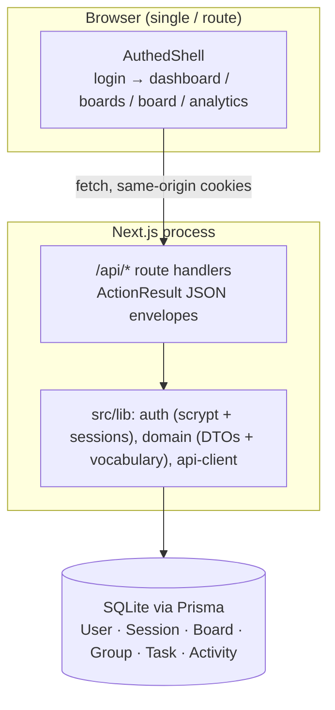

# Tuesday.com — Task Management


A monday.com-style work management platform: multi-group task boards with five
views (Main Table, Kanban, Calendar, Gantt Timeline, Unassigned), inline cell
editing, drag-and-drop status changes and owner assignment, and an analytics
dashboard — built as a single Next.js application on SQLite.

## Overview

Teams that plan work visually need three things at once: a spreadsheet-like
table for dense editing, a kanban board for flow, and analytics for
retrospectives. Tuesday.com keeps all three over one data model
(`Board → Group → Task`) so a status change made by dragging a kanban card is
immediately reflected in the table checkbox, the group progress bar, the
calendar, and the completion-rate charts. Everything runs in one process —
Next.js App Router for the UI, route handlers for the JSON API, Prisma over
SQLite for persistence — which makes the whole product cloneable with
`bun install` and two database commands.

## Key Features

| Feature | What it does |
|---------|--------------|
| 📋 Main Table view | monday-style spreadsheet: groups with colored accent bars, item counts, live completion percentages, per-row checkbox / priority flag / status pill / owner avatar / due date — all editable inline, regroupable by Status / Person / Priority |
| 🗂 Kanban view | Status columns (Not Started / Working on it / Done / Stuck) or People columns (Unassigned + one per member) with pointer-based drag-and-drop that persists status **and** owner changes to the database |
| 📅 Calendar view | Sun-first month grid with tasks pinned to their due dates, color-coded by status, overdue-safe date handling (noon storage) |
| 📈 Timeline & Unassigned views | Gantt-style timeline with Day/Week/Month zoom, day columns, and status-colored bars on due dates, plus a filter for tasks with no owner |
| 📊 Analytics dashboard | Solid colored KPI cards (total tasks, completion rate with progress bar, overdue count, active boards), status + priority horizontal-bar distributions, and per-board performance, filterable by board and time window (7/30/90 days) |
| 🏠 Dashboard home | Time-of-day greeting with live task count, four colored KPI stat cards, recent boards with lock/globe visibility pills and progress, quick actions, and an activity feed |
| 🔐 Email + password auth | scrypt-hashed passwords, opaque session tokens in httpOnly cookies (30-day TTL), login/signup/sign-out flows |
| 🎨 Board themes | Six board colors (Ocean Blue, Success Green, Warning Orange, Danger Red, Purple, Teal) driving accents across every surface |

## Architecture

| Layer | Technology | Version | Purpose |
|-------|-------------|---------|---------|
| Web framework | Next.js (App Router) | 16.1.3 | UI + API route handlers in one process |
| UI runtime | React | 19.2.3 | Client components with view-level state |
| Language | TypeScript | 5 (strict) | End-to-end typing; `tsc --noEmit` is a gate |
| Styling | Tailwind CSS | 4.1.18 | CSS-first `@theme inline` tokens; **no `tailwind.config.js`** |
| Components | shadcn/ui (new-york) + Radix | — | Dialog, Dropdown, Popover, Calendar, etc. primitives |
| ORM | Prisma | 6.19.2 | Schema, client, `db:push` |
| Database | SQLite | 3 | Zero-config persistence at `db/custom.db` |
| Validation | Zod | 4 | Every API input parsed before use |
| Drag & drop | @dnd-kit/core | 6.3.1 | Kanban card status changes and owner assignment |
| Dates | date-fns | 4.1.0 | Formatting and month grid math |
| Icons | lucide-react | 0.525.0 | Icon system |
| Package manager | Bun | ≥1.1 | Installs, runs scripts and the seed |



The app intentionally ships as a **single user-visible route** (`/`): the login
gate and all views switch client-side, which keeps every surface behind the
auth check and avoids route-level navigation entirely.

## File Hierarchy

```text
📂 src/
├── 📂 app/
│   ├── 📄 page.tsx                    ← auth gate + view router (the only route)
│   ├── 📄 layout.tsx                  ← Inter font, metadata, Toaster
│   ├── 📄 globals.css                 ← Tuesday.com theme tokens (Tailwind v4 @theme inline)
│   └── 📂 api/                        ← JSON API route handlers
│       ├── 📂 auth/{login,signup,logout,me}/route.ts
│       ├── 📂 boards/route.ts · 📂 boards/[id]/route.ts · 📂 boards/[id]/groups/route.ts
│       ├── 📂 groups/[id]/route.ts
│       ├── 📂 tasks/route.ts · 📂 tasks/[id]/route.ts
│       ├── 📂 dashboard/route.ts · 📂 analytics/route.ts · 📂 users/route.ts
├── 📂 components/
│   ├── 📂 app/                        ← product UI (17 components)
│   │   ├── 📄 app-header.tsx · app-context.tsx · login-view.tsx
│   │   ├── 📄 dashboard-view.tsx · boards-view.tsx · board-view.tsx
│   │   ├── 📄 board-table.tsx · board-kanban.tsx · board-calendar.tsx · board-timeline.tsx
│   │   ├── 📄 status-cell.tsx · priority-cell.tsx · owner-cell.tsx · date-cell.tsx
│   │   └── 📄 create-board-dialog.tsx · create-task-dialog.tsx · analytics-view.tsx
│   └── 📂 ui/                         ← shadcn primitives (vendored scaffold)
├── 📂 lib/
│   ├── 📄 domain.ts                   ← statuses, priorities, colors, DTOs, ActionResult
│   ├── 📄 auth.ts                     ← scrypt hashing + cookie sessions
│   ├── 📄 api-client.ts               ← typed fetch wrapper (never throws)
│   └── 📄 db.ts                       ← Prisma client singleton
├── 📂 hooks/ · 📂 prisma/schema.prisma · 📂 scripts/seed.ts · 📂 public/icon.svg
```

`docs/` and `skills/` at the repo root are the project's own documentation and
skill library (including the SSH push wrapper used for deployments) — they are
not part of the running app.

## Quick Start

Requires **Bun ≥ 1.1** (or npm ≥ 10 with Node ≥ 20 — swap `bun` for `npm run`
and run the seed with `npx tsx scripts/seed.ts`).

1. Install dependencies:

   ```bash
   bun install
   ```

2. Configure the database location:

   ```bash
   cp .env.example .env
   ```

3. Create the schema and seed demo data:

   ```bash
   bun run db:push      # creates ./db/custom.db from prisma/schema.prisma
   bun run db:seed      # demo account + 4 boards + 9 groups + 25 tasks
   ```

4. Start the dev server:

   ```bash
   bun run dev          # http://localhost:3000
   ```

### Verify Setup

- `bun run lint` → exits 0 with no output.
- `bunx tsc --noEmit` → no errors under `src/`.
- The login page renders the Tuesday.com logo and the email/password form.
- Sign in with the seeded demo account:
  - **Email:** `sepnetflix2023@outlook.com`
  - **Password:** `Abcd1234`
- The dashboard greets you by name and shows **4 boards / 7 completed / 18
  pending / 28% completion**.

Production build: `bun run build && bun run start` (standalone output on
port 3000).

## Environment Variables

| Variable | Required | Description | Default |
|----------|----------|-------------|---------|
| `DATABASE_URL` | Yes | SQLite file URL. Prisma resolves it **relative to `prisma/schema.prisma`** — `file:../db/custom.db` lands at the project root. | none |

That is the entire configuration surface: there are no API keys to provide,
and features that depend on external providers (Google OAuth, e-mail reset)
render honest "not configured on this deployment" messages instead of dead
buttons.

## Testing

| Check | Command | Notes |
|-------|---------|-------|
| Lint | `bun run lint` | ESLint 9 flat config, `eslint-config-next` defaults with **no rule weakening**; must exit 0 |
| Types | `bun run typecheck` | `tsc --noEmit`; strict mode fully on; `skills/` and `docs/` excluded — the vendored skill library is outside every gate |
| Unit tests | `bun run test` | Vitest, colocated `src/lib/*.test.ts` over the pure domain seams (status↔completed coupling, timeline window math, kanban grouping, distribution bars, saved-indicator format) |
| Build | `bun run build` | Standalone production build |
| Smoke (manual/agent-browser) | sign in as the demo user, drag a kanban card, reload | status change persists — verified against the database during development |

The TDD rule for new logic: write the failing test in `src/lib/*.test.ts`
first (red), implement the pure function in `src/lib/domain.ts` (green),
then wire it into components/routes. A red test is a regression or a wrong
test — never skip to pass. Playwright specs for the golden path remain the
natural next step; see `Project_Architecture_Document.md` §7 and §10.

## Design System

| Token | Hex | Usage |
|-------|-----|-------|
| `--background` | `#f5f7fa` | App background |
| `--card` | `#ffffff` | Cards, header, table rows |
| `--foreground` | `#323338` | Primary text |
| `--muted-foreground` | `#6b7385` | Secondary text |
| `--border` | `#e6e9ef` | Hairlines and card borders |
| `--primary` | `#0073ea` | Brand blue: buttons, links, focus rings |

| Status pill | Background | Text |
|-------------|-----------|------|
| Not Started | `#e8e9eb` | `#323338` |
| Working on it | `#fddf3d` | `#323338` |
| Done | `#00ca72` | white |
| Stuck | `#e2445c` | white |

Priority flags run Low → Critical in `#579bfc`, `#fcc203`, `#ff642e`,
`#e2445c`. Dashboard stat cards use solid blue/green/orange/purple
(`#3b82f6`, `#22c55e`, `#f97316`, `#a855f7`) with translucent deco circles.
Typography is **Inter** (Latin) via `next/font`, falling back to the system
stack. `prefers-reduced-motion` collapses all animations.

## Deployment (pushing to GitHub)

The canonical remote is SSH (`git@github.com:nordeim/task-management.git`);
pushes go through `docs/ssh_git_wrapper_v3.py` with an externally-supplied
deploy key — never a key committed to the repo. The operator runbook is
`docs/how-to-git-push-using-ssh-wrapper_SKILL.md`:

```bash
git add -A && git commit -m "feat(app): ..."
cat /secure/id_ed25519 | python3 docs/ssh_git_wrapper_v3.py --key-stdin \
  --remote git@github.com:nordeim/task-management.git
```

## License

Private project — all rights reserved by the repository owner.
