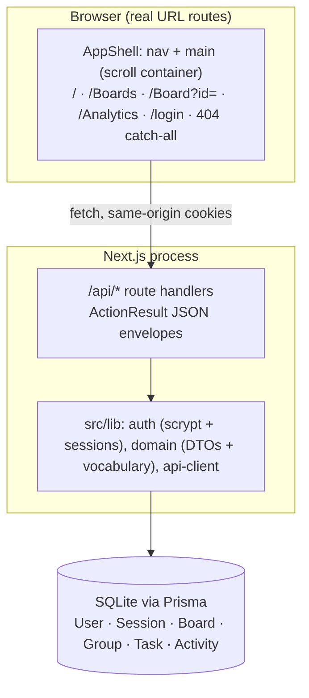

# Tuesday.com — Task Management


A monday.com-style work management platform: multi-group task boards with five
views (Main Table, Kanban, Calendar, Gantt Timeline, Unassigned), inline cell
editing, drag-and-drop status changes and owner assignment, and an analytics
dashboard — built as a single Next.js application on SQLite.

## Overview

Teams that plan work visually need three things at once: a spreadsheet-like
table for dense editing, a kanban board for flow, and analytics for
retrospectives. Tuesday.com keeps all three over one data model
(`Board → Group → Task`) so a status change made by dragging a kanban card is
immediately reflected in the table checkbox, the group progress bar, the
calendar, and the completion-rate charts. Everything runs in one process —
Next.js App Router for the UI, route handlers for the JSON API, Prisma over
SQLite for persistence — which makes the whole product cloneable with
`bun install` and two database commands.

## Key Features

| Feature | What it does |
|---------|--------------|
| 📋 Main Table view | monday-style spreadsheet: all groups live in ONE white card, each group zone with a 4px **group-color** left accent (per-group swatch from the Add New Group dialog), **per-status count dots in first-encounter order** + progress bar in the group header, per-row checkbox / tinted priority badge / status pill (white text) / owner avatar / due date — all editable inline, regroupable by Status / Person / Priority, with sticky column headers + sticky title/gutter columns in a horizontally scrollable sheet and a per-group footer summary row ("N items", up to three priority chips in first-encounter order with a "+N" overflow, status count bars, "N people", date range) |
| 🔍 Board toolbar | Search + Filter by Person (multi-select checkboxes over the board's distinct owners, with blue first-letter avatars and a red "Clear selection") + **Filter Items** (Status & Priority checkboxes — card menu with X close, priority rows without color dots) + **Sort By** (every column: Task Name / Created / Updated / Priority / Status / Owner / Due Date, asc⇄desc toggle with no off state) + **Show/Hide Columns** (checkbox + Eye/EyeOff rows, blue "Show all columns") + Group by — all card-styled menus with X close and count badges on the Person/Filter/Hide buttons, mirroring the reference; the toolbar renders only in the Main Table view |
| 🗂 Kanban view | Status columns (Not Started / Working on it / Done / Stuck) or People columns (only owners who own tasks, first-encounter order with LE-palette badges; Unassigned appears only when it holds items) with pointer-based drag-and-drop that persists status **and** owner changes to the database — cards carry the reference's gradient avatar (8-palette by first char code, 2-char initials) and blue due-date chips, click opens the Edit Task modal |
| 📅 Calendar view | Sun-first month grid rendering only the weeks needed (35 cells for most months), `gap-px` double-hairline cell borders, tasks pinned to their due dates as plain white chips (click opens the Edit Task modal), overdue-safe date handling (noon storage) |
| 📈 Timeline & Unassigned views | Gantt-style timeline with Day/Week/Month zoom (native select, `gap-1` toolbar), fixed 40px week / ~171px month day columns with stacked weekday/number headers and no today highlight — task rows are the reference's anatomy (32px `flex border-b` rows, static 200px `text-xs` labels, one unbordered `flex-grow relative` body container per row), status-colored due-date bars render absolutely inside that single container (documented deviation — the reference never draws bars), plus a filter for tasks with no owner |
| 📊 Analytics dashboard | Gradient KPI cards (inline icon + text-lg label, text-3xl value, color-100 subtitle; completion rate with full-width green-300 track), status + priority horizontal-bar distributions in **first-encounter order over updatedAt-desc tasks with zero-count rows omitted** (blue Activity / orange TrendingUp headers), and per-board performance rows in board order (gray-50 row cards with progress bar + bordered % chip), filterable by board and time window (7/30/90 days) |
| 🏠 Dashboard home | Time-of-day greeting with live task count, four reference KPI cards (`group perspective-1000` gradient buttons with deco discs, hover particles, white/20 icon tiles, shine sweep + hover ring), recent boards with folder tiles and **gradient visibility badges** in the right zone (orange→red private, green→emerald shared), real anchor rows (`/Board?id=` links with hover borders + chevron that turns blue), a `/Boards` "View All" ghost button with ArrowRight, gradient quick-action rows, and a **top-5 Recent Activity feed** (`space-y-3` rows, clock tiles, absolute `Sep 17, 1:36 AM` times) |
| 🧭 Real URL routes | Dashboard `/`, boards `/Boards`, board `/Board?id=`, analytics `/Analytics`, login `/login` — case-insensitive via rewrites, browser back/forward works, per-route document titles (`… | Task Management`), logged-out visits redirect to `/login?from_url=…` and return after sign-in, unknown paths render the styled slate 404 (server-rendered catch-all) |
| ✏️ Board & group management | Create **and edit** boards (title, description, 6 colors, Private/Shared visibility) from the boards page Options menu; **Add New Group** dialog with 7 named color swatches; rename inline from the board header; boards page renders grid or list cards (top color bar / left color stripe, p-5 body, footer Options zone) |
| ✏️ Task editing | Click any kanban card, its Ellipsis button, or a calendar chip to open the reference's **Edit Task modal** (`sm:max-w-2xl`): Task Title + two-column grid (Priority select, Status select, Owner free-text, Due Date calendar popover) and a `pt-4 border-t` footer — Delete Task (red, behind `window.confirm`) | Cancel + Save Changes (blue). Inline table cells (status pill swap, priority select, free-text owner, date input) stay |
| 🪟 Board-header modals | The board header's **Analytics** button opens the reference's **Board Analytics modal** (`Ote`): three gradient stat cards (Total Tasks / Completion Rate with inline Progress / Overdue = dueDate < now && status ≠ done), a vocabulary-order Status Distribution card (zero counts included, `w-3 h-3` palette dots, outline %-badges), a first-encounter top-5 Team Workload card (solid-blue initial avatars), and a top-5 24-hour Recent Activity feed ("Updated Sep 17, 22:01") — over the board's UNFILTERED task set; **Integrate** opens the **Integrations Center** (8 brand-tiled cards — Slack/Drive/GitHub/Figma/Zoom/Jira/Shopify/HubSpot — with local-state Switches that reset on close, like the reference); **Automate** opens the **Automations Center** (banner + Create Custom Automation button + 5 recipe cards with the same switch/tile anatomy). Configure/Customize buttons mirror the reference's inert mock behavior |
| 📅 Due dates | Native date input (matches the reference), stored at local noon so timezone edges never shift the rendered day; the set state renders as plain `Sep 22` text (no icon) and past dates turn into red-tinted chips |
| 👤 Owner cells | Free-text "Enter name…" inline input (commit on blur/Enter, Escape cancels) resolving to a member account; assigned rows show a solid-blue 24px first-letter avatar + name — kanban cards show the reference's 8-gradient avatar with 2-char initials |
| 🔐 Email + password auth | scrypt-hashed passwords, opaque session tokens in httpOnly cookies (30-day TTL), login/signup/sign-out flows |
| 🎨 Themes | Six board colors (Ocean Blue, Success Green, Warning Orange, Danger Red, Purple, Teal) driving accents across every surface, plus seven per-group swatches (adds Gray `#676879`) driving each group's 4px left accent |
| 📱 Responsive shell | Desktop nav with the reference's exact-match active highlight (`bg-[#E1E5F3] text-[#0073EA]` via `isNavActive`; `/` highlights nothing) plus a mobile hamburger with an inline collapsible panel; global "Search everything…" board search; **no app footer** (like the reference) |

## Architecture

| Layer | Technology | Version | Purpose |
|-------|-------------|---------|---------|
| Web framework | Next.js (App Router) | 16.1.3 | UI + API route handlers in one process |
| UI runtime | React | 19.2.3 | Client components with view-level state |
| Language | TypeScript | 5 (strict) | End-to-end typing; `tsc --noEmit` is a gate |
| Styling | Tailwind CSS | 4.1.18 | CSS-first `@theme inline` tokens; **no `tailwind.config.js`** |
| Components | shadcn/ui (new-york) + Radix | — | Dialog, Dropdown, Popover, Calendar, etc. primitives |
| ORM | Prisma | 6.19.2 | Schema, client, `db:push` |
| Database | SQLite | 3 | Zero-config persistence at `db/custom.db` |
| Validation | Zod | 4 | Every API input parsed before use |
| Drag & drop | @dnd-kit/core | 6.3.1 | Kanban card status changes and owner assignment |
| Dates | date-fns | 4.1.0 | Formatting and month grid math |
| Icons | lucide-react | 0.525.0 | Icon system |
| Package manager | Bun | ≥1.1 | Installs, runs scripts and the seed |



The app serves **real URL routes** that mirror the reference exactly: `/` (and
`/Dashboard`) for the dashboard, `/Boards` for the boards list, `/Board?id=`
for a board (sub-views are client state — the URL never changes, like the
reference), `/Analytics`, `/login`, and a server-rendered catch-all that
renders the styled 404 for anything else. Capitalized spellings rewrite to
the canonical lowercase routes, so `/boards` and `/Boards` both work. The
authed surfaces live in an `(app)` route group whose layout boots the session
and redirects logged-out users to `/login?from_url=<original>`; login and the
404 render bare, outside the shell. The shell's `<main>` is the scroll
container (`flex-1 overflow-y-auto`), matching the reference.

## File Hierarchy

```text
📂 src/
├── 📂 app/
│   ├── 📂 (app)/                      ← authed route group (AppShell layout)
│   │   ├── 📄 page.tsx                ← / dashboard
│   │   ├── 📂 boards/ · 📂 board/ · 📂 analytics/ ← real routes
│   ├── 📂 login/page.tsx              ← /login (bare, renders even when authed)
│   ├── 📂 [...path]/page.tsx          ← styled 404 catch-all (server-rendered titles)
│   ├── 📄 not-found.tsx · 📄 layout.tsx ← 404 root + Inter font, metadata, Toaster
│   ├── 📄 globals.css                 ← Tuesday.com theme tokens (Tailwind v4 @theme inline)
│   └── 📂 api/                        ← JSON API route handlers
│       ├── 📂 auth/{login,signup,logout,me}/route.ts
│       ├── 📂 boards/route.ts · 📂 boards/[id]/route.ts · 📂 boards/[id]/groups/route.ts
│       ├── 📂 groups/[id]/route.ts
│       ├── 📂 tasks/route.ts · 📂 tasks/[id]/route.ts
│       ├── 📂 dashboard/route.ts · 📂 analytics/route.ts · 📂 users/route.ts
├── 📂 components/
│   ├── 📂 app/                        ← product UI (22 components + 5 route wrappers)
│   │   ├── 📄 app-shell.tsx · app-context.tsx · app-header.tsx · login-view.tsx
│   │   ├── 📄 dashboard-view.tsx · boards-view.tsx · board-view.tsx · board-not-found.tsx
│   │   ├── 📄 board-table.tsx · board-kanban.tsx · board-calendar.tsx · board-timeline.tsx
│   │   ├── 📄 status-cell.tsx · priority-cell.tsx · owner-cell.tsx · date-cell.tsx
│   │   ├── 📄 create-board-dialog.tsx · edit-board-dialog.tsx · create-task-dialog.tsx · create-group-dialog.tsx
│   │   ├── 📄 analytics-view.tsx · not-found-view.tsx
│   │   └── 📂 routes/                 ← dashboard/boards/board/analytics/login route components
│   └── 📂 ui/                         ← shadcn primitives (vendored scaffold)
├── 📂 lib/
│   ├── 📄 domain.ts                   ← statuses, priorities, colors, DTOs, route paths, ActionResult
│   ├── 📄 auth.ts                     ← scrypt hashing + cookie sessions
│   ├── 📄 api-client.ts               ← typed fetch wrapper (never throws)
│   └── 📄 db.ts                       ← Prisma client singleton
├── 📂 hooks/ · 📂 prisma/schema.prisma · 📂 scripts/seed.ts · 📂 public/icon.svg
```

`docs/` and `skills/` at the repo root are the project's own documentation and
skill library (including the SSH push wrapper used for deployments) — they are
not part of the running app.

## Quick Start

Requires **Bun ≥ 1.1** (or npm ≥ 10 with Node ≥ 20 — swap `bun` for `npm run`
and run the seed with `npx tsx scripts/seed.ts`).

1. Install dependencies:

   ```bash
   bun install
   ```

2. Configure the database location:

   ```bash
   cp .env.example .env
   ```

3. Create the schema and seed demo data:

   ```bash
   bun run db:push      # creates ./db/custom.db from prisma/schema.prisma
   bun run db:seed      # demo account + 4 boards + 9 groups + 25 tasks
   ```

4. Start the dev server:

   ```bash
   bun run dev          # http://localhost:3000
   ```

### Verify Setup

- `bun run lint` → exits 0 with no output.
- `bunx tsc --noEmit` → no errors under `src/`.
- The login page renders the Tuesday.com logo and the email/password form.
- Sign in with the seeded demo account:
  - **Email:** `sepnetflix2023@outlook.com`
  - **Password:** `Abcd1234`
- The dashboard greets you as **sepnetflix2023** and shows **4 boards / 7
  completed / 18 pending / 28% completion**.

Production build: `bun run build && bun run start` (standalone output on
port 3000).

## Environment Variables

| Variable | Required | Description | Default |
|----------|----------|-------------|---------|
| `DATABASE_URL` | Yes | SQLite file URL. Prisma resolves it **relative to `prisma/schema.prisma`** — `file:../db/custom.db` lands at the project root. | none |

That is the entire configuration surface: there are no API keys to provide.
Features that depend on external providers (Google OAuth, e-mail reset)
render honest "not configured on this deployment" messages instead of dead
buttons; the board header's **Integrate** and **Automate** buttons open the
reference's full Integrations/Automations Center modals (local-state mocks —
the reference's toggles and Configure buttons are non-persisting mock UI,
verified against the live app).

## Testing

| Check | Command | Notes |
|-------|---------|-------|
| Lint | `bun run lint` | ESLint 9 flat config, `eslint-config-next` defaults with **no rule weakening**; must exit 0 |
| Types | `bun run typecheck` | `tsc --noEmit`; strict mode fully on; `skills/` and `docs/` excluded — the vendored skill library is outside every gate |
| Unit tests | `bun run test` | Vitest, colocated `src/lib/*.test.ts` (120 tests) over the pure domain seams (status↔completed coupling, timeline window math, kanban grouping, distribution bars **incl. first-encounter ordering with zero-omission**, saved-indicator format, task filter/sort pipeline — incl. the 7-field sort with nulls-last — column visibility, group summary with badge cap/overflow, relative time, reference palette, priority badge recipe, visibility labels, view-trigger labels, kanban card border token, group color options, route paths, nav active-state matcher, dynamic calendar weeks, summary date/owner labels, team avatar palettes, 404 titlecase helper, recent-task time format, kanban avatar gradient/initials, group-header status dots, distinct owner names, people-column palette, **team workload counts, recent-activity items, board modal stats, board-modal 24-hour timestamps**) |
| Build | `bun run build` | Standalone production build |
| Smoke (manual/agent-browser) | sign in as the demo user, edit a board, filter/hide/sort, drag a kanban card, reload | changes persist — verified against the database during development |

The TDD rule for new logic: write the failing test in `src/lib/*.test.ts`
first (red), implement the pure function in `src/lib/domain.ts` (green),
then wire it into components/routes. A red test is a regression or a wrong
test — never skip to pass. Playwright specs for the golden path remain the
natural next step; see `Project_Architecture_Document.md` §7 and §10.

## Design System

| Token | Value | Usage |
|-------|-----|-------|
| `--background` | `#f5f6f8` | App background |
| `--card` | `#ffffff` | Cards, header, table rows |
| `--foreground` | `hsl(0 0% 3.9%)` | Inherited text (button labels, calendar numbers) |
| `--primary` | `hsl(0 0% 9%)` | Checkbox checked fill, shadcn default buttons |
| `--muted-foreground` | `#676879` | Secondary text |
| `--border` / `--input` | `hsl(0 0% 89.8%)` | Hairlines and card borders |
| `--table-header-bg` | `#f5f6f8` | Table column-header band |
| `--table-track-bg` | `#e1e5f3` | Group progress track |
| `--group-progress-fill` | `#00c875` | Group progress fill |

The app blue is **not a token**: like the reference, every blue surface is an
explicit `#0073EA` class (New Task button, nav links, picker checkmarks,
focus accents, calendar today ring), while the grayscale tokens mirror the
reference's shadcn defaults — Tailwind v4 passes raw `var()` values through,
so HSL tokens must be complete `hsl(…)` colors.

| Status pill (all white text) | Background |
|-------------|-----------|
| Not Started | `#c4c4c4` |
| Working on it | `#ffcb00` |
| Done | `#00c875` |
| Stuck | `#e2445c` |

Priorities render as **tinted text badges** (background at 12.5% alpha over
the solid color, which is also the text color): Low `#787d80`, Medium
`#ffcb00`, High `#fdab3d`, Critical `#e2445c` — via the unit-tested
`priorityBadgeStyle`. Kanban card left borders are a FIXED neutral
`#E1E5F3` (`KANBAN_CARD_BORDER`), not status-colored. The view-dropdown
trigger shows short labels ("Main table", "Kanban", "Calendar", "Timeline")
while its menu lists the long ones (`VIEW_TRIGGER_LABELS`); the trigger
itself is a constant-`Table2` icon pill (`h-6 px-2 text-xs text-[#676879]`
with `hover:bg-[#E1E5F3]`). Dashboard KPI cards are the reference's
`perspective-1000` gradient buttons — `from-{blue|green|amber|purple}-500
to-…-600` with white/20 backdrop-blur icon tiles, deco discs, six hover
particles, a shine sweep, and a hover ring; analytics keeps its inline-icon
stat cards with the near-black `#171717` translateX completion fill on a
green-300 track. Quick actions are gradient rows (blue→cyan, green→emerald,
amber→orange, purple→pink). The board header is a full-width sticky white
bar (`top-16 z-40`) inside a gray sticky wrapper (`top-0 z-20 pb-4`) with a
blue `h-1` strip that flips from `scaleX(0)` to full width once the page
scrolls past 32px. Board palette (6): `#0073ea`, `#00c875`, `#ffcb00`,
`#e2445c`, `#a25ddb`, `#00d9ff`; group palette (7, `GROUP_COLOR_OPTIONS`)
adds Gray `#676879`. The header logo is a gradient tile (`#2563EB→#1D4ED8`)
with a white briefcase icon. Typography is **Inter** (Latin) via `next/font`,
falling back to the system stack. `prefers-reduced-motion` collapses all
animations. Page containers: `max-w-7xl` on dashboard/boards/analytics
(padding outside the container, like the reference), `max-w-full` on the
board detail.

## Deployment (pushing to GitHub)

The canonical remote is SSH (`git@github.com:nordeim/task-management.git`);
pushes go through `docs/ssh_git_wrapper_v3.py` with an externally-supplied
deploy key — never a key committed to the repo. The operator runbook is
`docs/how-to-git-push-using-ssh-wrapper_SKILL.md`:

```bash
git add -A && git commit -m "feat(app): ..."
cat /secure/id_ed25519 | python3 docs/ssh_git_wrapper_v3.py --key-stdin \
  --remote git@github.com:nordeim/task-management.git
```

## License

Private project — all rights reserved by the repository owner.
